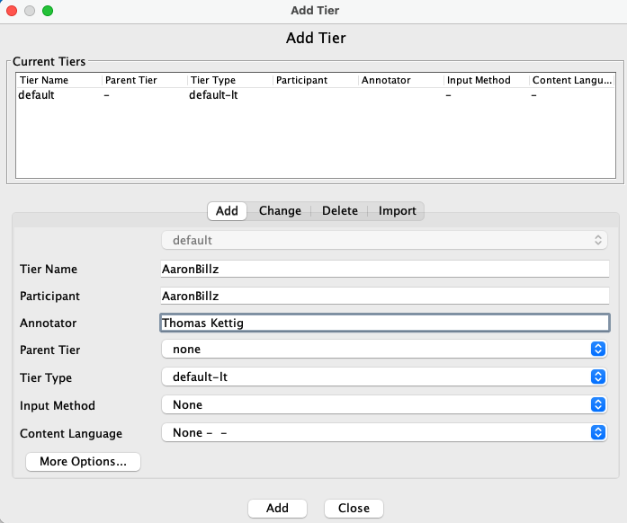

***
### __Downloading ELAN__
ELAN is a flexible tool for language annotation, whether your data is audio or video. It allows for the creation of multiple tiers for different speakers but also for coding particular features that are under study. 

You can download ELAN from the [Language Archive website](https://archive.mpi.nl/tla/elan/download). It is available for Windows, Mac, and Linux.

 

### __Opening a new transcription file in ELAN__
To create a new transcription file, go to _File > New > Add Media File..._ and select the video or audio that you want to transcribe. In this class, we'll be working together on the Snowd4y interview video, so select the .mp4 file.

Even though we could do our segmentation and transcription on just this video file as-is, it will be easier if we also have a waveform that we can see along with the video. Also select the corresponding .wav file. 

Once you have both the .mp4 and the .wav selected, click _OK_.

 

> __TIP:__  
SAVE YOUR ELAN FILE RIGHT NOW. Until it has a beginning save point, ELAN cannot create autosaves, nor does it prompt you for unsaved data. You are liable to lose many hours of work by accident. So save it now!!

 

Please save this file with the name "Snowd4y_Interview_FIRSTNAME_LASTNAME" (with your own first and last name).

When you save this, two files will be created: an .eaf file and a .pfsx file. The .eaf file is the more important one, and is what we'll mean when we refer to an "ELAN file". The .pfsx file is just a preferences file that keeps track of things like where in the .eaf you were last working. It's not important and you won't need to submit it with your work this semester.

### __Preparing your transcript__

You'll now need to add a tier for each of your speakers. Go to _Tier > Add New Tier..._ and add the Tier Name, Participant, and Annotator information to one tier per speaker. You can leave the other fields the way they are.

 

 

You'll see that there are different tabs to _Add_, _Change_, _Delete_, and _Import_ tiers. Your file will come with a "default" tier that you can delete, or you can change it so that it's one of your speaker tiers.

Once you've added all your speakers' tiers and closed the Add Tier window, your ELAN window should look something like this:
 

 

> __TIP:__  
You can make the waveform and video bigger and smaller by adjusting the sizes of the different quadrants of the window.

### __Segmenting your transcript__

Go to _Options > Segmentation Mode_. In this mode, it will be easier to segment your file into chunks of a few seconds each. Doing so will set you up to more efficiently carry out your transcription. Essentially, you'll want to create a segment on each tier that corresponds with portions of the file during which that speaker is speaking. Since the speakers overlap a lot in this recording, there will be some overlap of segments on different tiers.

One thing to do now is make sure that the keyboard shortcuts are as efficient as they can be. Go to _Edit > Preferences > Edit Shortcuts_ and find the shortcuts for Segmentation Mode. For my version of ELAN, the default shortcut for the Play/Pause was ^ + SPACE rather than the much easier SPACE alone. I recommend editing the "Play / Pause the media" shortcut to just be the space bar. Do so now.

Now you can click the space bar to play and pause the file, and you can hit the ENTER or RETURN key to create a segment boundary.

You can select which tier you're currently working with by double-clicking the tier name, or by using the UP and DOWN keys on your keyboard. You'll see a red indicator showing which one is selected and the selected tier named in red at the top.

In the upper right quadrant, there are various options for how you'd like to segment. In portions where one person is speaking for a long time, the "One keystroke per annotation (adjacent annotations)" might work well. In portions where a speaker only produces a few utterances separated by silences, the "Two keystrokes per annotation (non-adjacent annotations)" might work well. You can check the box for "delayed mode" and enter the number of milliseconds that your keystroke is delayed after hearing the end of an intonational unit. You can play around with these options and feel out what works best for you.

> __TIP:__  
In the upper right you'll also see a "Controls" tab. You can adjust the volume and speed here. Both segmentation and transcription are often much easier at a reduced speed rate.

To destroy the last created boundary, hover over the segment so that it turns green and hit BACKSPACE or DELETE.

You can go back and re-insert additional boundary points by splitting and merging segments. To do this, hover over a segment so that it highlights in green and then right click to bring up the segment menu. If you select _Split Annotation_ it will split the segment at the point of your cursor.

You have been assigned a section of the interview that's under 5 minutes long. Finish the segmentation of all three speakers in your assigned section and submit your .eaf file as part of Homework 1. Ideally, your segments should be present whenever the speaker on that tier is making noise. After fully segmenting who is speaking when, your file will look something like this:

 

 

Next week we'll start on transcription.

