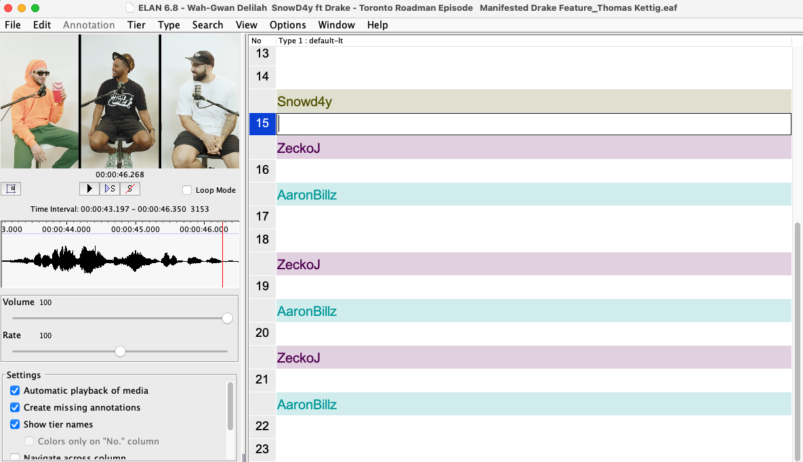

***
### __Transcribing in ELAN__

Now that you've segmented a portion of the interview, it's time to transcribe. To move into transcription mode, save the file and go to _Options > Transcription mode_. 

A window called _Transcription mode settings_ will pop up. Where it says _\<select a type>_, click and select _default-lt_. Then click _Apply_. Your screen should look something like this:

 

 

Your segments are represented as blank lines, with changes in speaker represented in coloured bars. You can click on any empty segment to hear that segment played as you transcribe. To move to the next segment, hit the ENTER key, and to edit a previous segment click on that segment. 

> __TIP:__  
For efficient transcription, check the box for _Loop Mode_. That way each segment will play over and over without you having to click anything. In addition, it will be useful to reduce the sound speed using the rate toggle.

In this particular interview, they talk over each other a lot, so looking at the video to verify whose lips are saying what will be very useful here. Pay attention to the speaker label above the segment you're transcribing.

Complete the transcription of your assigned interview section. 