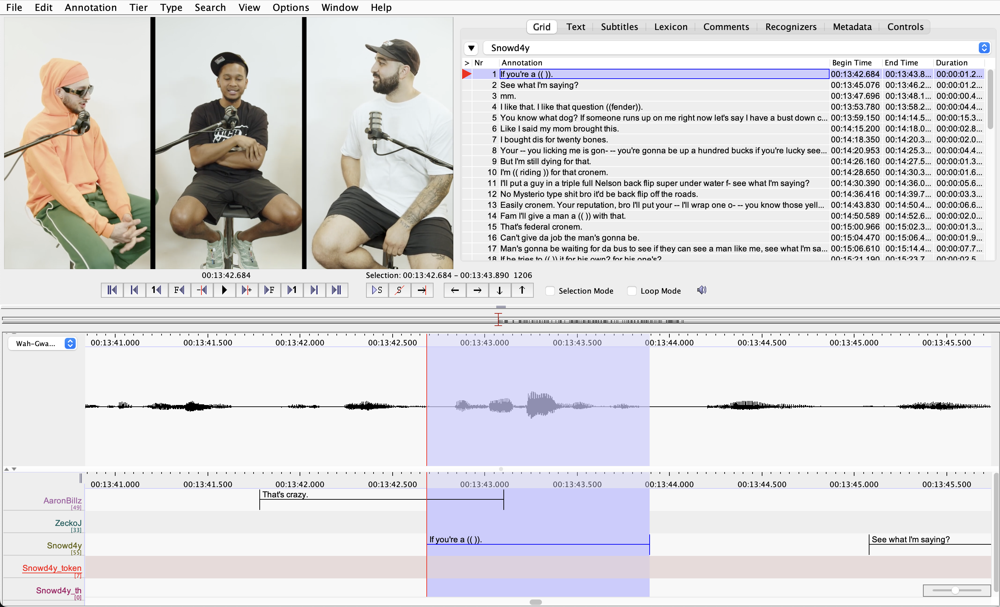
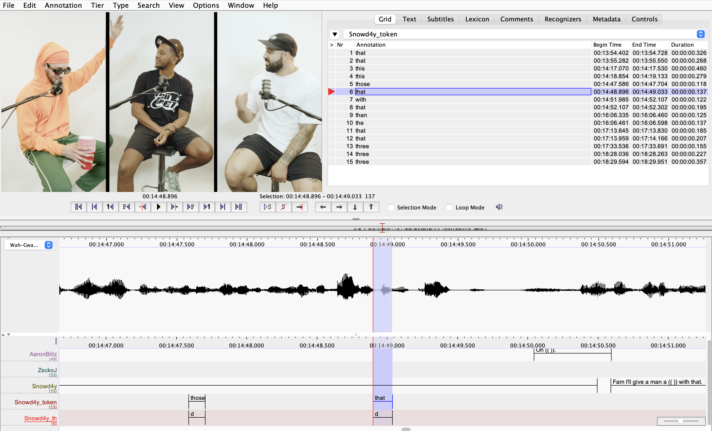

***
### __Coding a dependent variable in ELAN__

Now that you have a portion of the interview transcribed, we'll start by identifying all instances of a particular sociolinguistic variable. In experimental terms, this will be a __dependent__ variable.

The sociolinguistic variable we'll code now is (th). For now, we'll define this variable as all sounds which in Standard Canadian English are conventionally pronounced as [θ] or [ð]. (This could be considered two variables, a voiced (dh) and a voiceless (th), each with a fricative and stop variant, but we'll code them both together here.) These should mostly correspond to sounds which are orthographically spelled with \<th>. An exception might be a word like "Thomas" which is spelled with a \<th> but is not conventionally pronounced with a fricative in any variety of Canadian English, so it doesn't count as an instance of (th).

### __Finding and labelling tokens of the dependent variable__

Open your .eaf file and select __Options > Annotation mode__. Go to __Tier > Add new Tier...__. Add one tier called "Snowd4y_token", with Snowd4y as the Participant and yourself as the Annotator. Add another tier called "Snowd4y_th", also with Snowd4y as the Participant and yourself as the Annotator.

At the top of the window, select "Grid" view and where it says "select a tier", select the Snowd4y tier. Your window should now look something like this:

 

 

Read through your transcript, shown in the grid in the upper-right quadrant of the window. Find the first instance of a word containing (th), and click on that annotation; it will now show up highlighted in the tiers below. Listen (Shift+SPACE, or click the Play button with the blue triangle) and try to select all and only the syllable containing that instance of (th). Keep looking, selecting, and listening; this will take some trial and error. You may want to make the waveform larger and zoom in fairly close to the recording to be able to successfully find the boundaries of the syllable containing (th). 

  

When you have highlighted the appropriate section of the soundwave, double-click in the "Snowd4y_token" tier within the shaded section; a field will be created that is the size of the portion of the sound that you highlighted. That field, and whatever text you type in it, is time-aligned to that part of the sound. In the annotation field, type the __word__ that contains the (th). Then press Enter.

  

> __TIPS:__  
Remember that you can find what keyboard shortcuts to use by hovering your cursor over buttons. Consider using keyboard shortcuts to make your life easier. You can always change shortcuts if the default one is not convenient for your workflow (see Tutorial 1).   You can switch back and forth from Grid to Controls in order to adjust the play rate and volume.   You can use the toggle located in the far lower-right corner of the ELAN window to zoom in and out of the waveform. Zoom in to a comfortable scale so that you're able to select each syllable containing an instance of (th). 

 

Continue through your section of the interview to label all instances of (th).

### __Coding your dependent variable__

In the Grid field in the upper-right quadrant, change the tier you're viewing to "Snowd4y_token". You should now see the list of words you've identified that contain (th). Find the first one and click it; the field should now be highlighted below. Now, double-click in the "Snowd4y_th" tier, and a field will be created that is the same size as the field in the "Snowd4y_token" tier.

  
Listen closely a few times to the (th) token you've selected. In each annotation field in the "Snowd4y_th" tier, code the (th) variable according to the following coding scheme. Hit "enter" after typing in the appropriate code.

|  _What you hear_  |  _What to type in Snowd4y_th_  |
|:-----------------:|:------------------------------:|
|       [ð]         |            dh                  |
|       [θ]         |             th                 |
|       [d]         |              d                 |
|       [t]         |              t                 |
|    unsure         |              ?                 |

Things you may be unsure of could include instances of (th) where there is too much background noise to be confident in what you hear. There may be instances of (th) that are in a neutralizing phonological context (e.g. the (th) variants in "with that" where the two (th) may blend in with one another so you can't be sure of which (th) goes with which word). You may also come across some sort of intermediate pronunciation you're not sure how to code. Those can all be coded as _?_.

> __NOTE:__  
Capitalization matters when you are coding tokens! "D" will not be seen as the same thing as "d" when you start running your analyses.

Once you have coded a few tokens, your window should look something like this:

 

 

Keep going until you've finished coding all the (th) from Snowd4y that appear in your assigned section of the interview.

Other variables we can code later, known as independent variables, might explain some of the variation in dependent variables. These could include demographic features of a speaker (e.g. gender, age, race), stylistic and discourse factors (e.g. interlocutor, formality, topic), and contextual linguistic factors (e.g. part of speech, preceding or following phoneme, word frequency).
