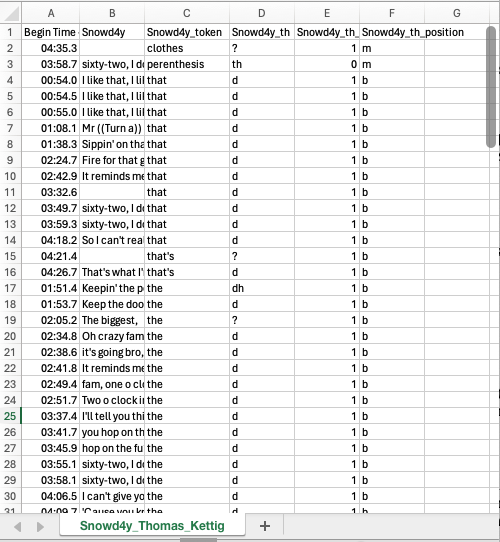

***
### __Coding independent linguistic variables in ELAN__

Now that we've coded instances of a __dependent__ linguistic variable, we need to code various __independent variables__ that could affect the rate of occurrence of the possible variants of that dependent variable. Independent variables can include speaker information like demographic factors (age, gender, etc.) and could also include linguistic factors. 

Every dependent linguistic variable will have its own set of possible independent variables of interest. The best way to know what independent variables to code is to do a thorough review of the literature on a particular linguistic variable (or closely related ones) to see what other scholars have done before you. In this case, there is lots of previous literature on (th) variation in English. [Bigelow et al. (2020)](https://repository.upenn.edu/entities/publication/42c9418c-4efa-48be-8fbd-3b01f61e3668) code (th) in Toronto for three independent social variables (gender, age, and age of arrival in Canada) and two independent linguistic variables (voicing and word-initial position). We'll therefore be coding those two independent linguistic variables.

Create one new tier called _Snowd4y_th_voicing_ and one new tier called _Snowd4y_th_position_ (go back and read our ELAN Tutorial Part 3 if you've forgotten how to add a new tier). Go into Annotation mode and select Grid view. From the drop-down menu, select the tier _Snowd4y_token_ to view within the grid.

Just like you did in Part 3 for coding the dependent variables, you'll now code each token for the two independent variables. To do this, go through the list of tokens in the grid and select each in turn. This will highlight the token in the tiers below. You'll then double-click in the relevant tier ("_Snowd4y_th_voicing_" or "Snowd4y_th_position"), right below the token. In the new field that appears, type in the 1-letter code that describes the appropriate linguistic context:

|  _Code_  |     _Description_  |  _Example_      |
|:--------:|:------------------:|:----------------:
|   0      |   voiceless        |  <b>th</b>ing   |
|   1      |   voiced           |  <b>th</b>e     |

Table: Independent variable 1: (th) voicing

|  _Code_  |     _Description_          |  _Example_      |
|:--------:|:--------------------------:|:----------------:
|   b      | <b>b</b>eginning of word   |  <b>th</b>e     |
|   m      | <b>m</b>iddle of word      |  wi<b>th</b>in  |
|   e      | <b>e</b>nd of word         |  ma<b>th</b>    |

Table: Independent variable 2: Word position

 

Your resulting ELAN file should look something like this:

 

While the coding for these particular independent variables will usually be pretty clear-cut, be sure to code what you hear the speaker saying. For instance, the word "within" could have a voiced or voiceless (th) in North American English depending on the speaker, so go with what the speaker himself says (here, he says wi[θ]in, so it's coded as "0" for voiceless).

If you need to make any notes about questionable tokens, etc., you can add a "Notes" tier and add so you can find them later. (This is much more efficient that writing them down somewhere else!)

  

### __Exporting your data to an Excel-readable .txt file__

The next step is to export your coded tokens, along with the transcription and timestamps, to a .txt file which will allow for analysis.

In ELAN, click __File > Export as > Tab-delimited Text__. In the __Select tiers__ box, make sure _Snowd4y_, _Snowd4y_token_, _Snowd4y_th_, _Snowd4y_th_voicing_, and _Snowd4y_th_position_ are checked. Under __Output options__, make sure "Separate column for each tier" and "Repeat values..." are checked. Under __Include time column for:__ have "Begin Time" checked. In __Include time format:__ have just the first box checked (hh:mm:ss.ms). Click OK.

Name the file __Snowd4y_YOURLASTNAME_YOURFIRSTNAME.txt__ when you save it. It'll ask you for the encoding to use, so select UTF-8 (the default). 

Now open the .txt file in Excel. (You can do this by right-clicking the .txt file and selecting Excel in the "Open with" menu.) If you don't have Excel installed on your computer, you can open the .txt file up in a Notepad or TextEdit type application and then copy+paste the contents of the .txt into a new Excel workbook in the [online version](https://www.microsoft365.com/launch/excel?auth=2) your York account gives you access to.

In the __Data__ menu on the top of the Excel screen, click "Sort". In the window that pops up, select "Snowd4y_token".

Your sheet should now look something like this (though the actual coded tokens will of course depend on what group you're in):

> __NOTE:__  
In my sheet above, you can see a couple of blanks in the _Snowd4y_ column where data in the other columns is filled in: For example, an instance of "that" at time 03:32.6 is missing the transcript context in the _Snowd4y_ column. This will happen if the beginning point of the annotation for the transcript in the _Snowd4y_ column is erroneously put after the beginning point of the other annotations. See the screenshot below: The annotation containing "That's federal cronem but I'll tell you this" doesn't start until a fraction of a second after the beginning of the annotations on the _Snowd4y_token_, _Snowd4y_th_, _Snowd4y_th_voicing_, and _Snowd4y_th_position_ tiers. If this happens, go back to ELAN, go into Annotation mode, and adjust the annotation on the _Snowd4y_ tier such that it starts before the annotations in the token and variable coding tiers. Then redo the above steps to export to tab-delmited text again. Of course, it's easier if you keep an eye out for this early on in your transcription and coding process so that you don't have to keep going back and correcting your mistakes!

 

Now, in your Excel sheet, scroll down until you find the rows which have blank cells in the _Snowd4y_token_, _Snowd4y_th_, _Snowd4y_th_voicing_, and _Snowd4y_th_position_ columns. Delete those rows so that you're left with only the useful rows - in other words, those that contain Snowd4y's tokens of (th) and your codings for them.

> __TIP:__  
It's also possible to first export the _Snowd4y_, _Snowd4y_token_, and _Snowd4y_th_ tiers into this Excel-readable format, then create new columns called _Snowd4y_th_voicing_ and _Snowd4y_th_position_, and then your independent variable coding directly in Excel. The advantage of doing the Excel export step first is that by sorting all the tokens alphabetically, you may save a bunch of time - all of the "that" tokens in the dataset will be coded as "1" for _Snowd4y_th_voicing_ and as "b" for _Snowd4y_th_position_, so it's easy to "drag down" a code you've put in for one cell and instantaneously code many cells at once. The drawback is that you won't be able to listen out for possible instances of the speaker not using an expected pronunciation of a word. For instance, without listening to Snowd4y in ELAN, I might assume that the word "within" is voiced and thus should be coded as "1" for _Snowd4y_th_voicing_; however, when we listen closely to how he pronounces it, he actually uses a voiceless consonant, so it should really be coded as "0". On the other hand, in this particular example, we could also derive this information from the fact that it's coded as "t" in the _Snowd4y_th_ column, which by definition means it was heard by the coder as voiceless. So if you conduct these steps in your own research, you may use your judgement as to whether it's best to code independent linguistic variables in ELAN first and then export to .txt, or first export to .txt and then do your coding in Excel.

Now, in your Excel sheet, create a new column between the _Begin Time_ column and the _Snowd4y_ column and call it _Speaker_. Fill all cells in that column with "Snowd4y"; you can do this quickly by typing "Snowd4y" in the top cell of the column and then double-clicking the cell's lower-right corner. Now, rename the column that we've been calling _Snowd4y_ to something more accurate like _Transcript_. Your sheet should now look something like this:

  

> __TIP:__  
If we wanted to complete our analysis of (th) for all speakers in this interview using the steps in Part 3-4 of our tutorial, we could now repeat those steps with AaronBillz and ZeckoJ, copy+paste their rows of data to the end of this spreadsheet, and we'd have a full multispeaker dataset all in one sheet. While we won't do this now, this strategy is something you can consider if you write your final paper on a variable from this interview. If we were to have a lot of different speakers, we might want to create more columns to code the gender, age, ethnicity, or other social characteristics of the speakers, but in this case we just have three speakers, so coding for socio-demographic independent variables is not as important.

Now go to __File > Save__ and save your file. If you're using the online version of Excel, you can go to __Export >  Download this sheet as CSV__ and save it as __Snowd4y_YOURLASTNAME_YOURFIRSTNAME.csv__. Upload this .txt or .csv file to eClass as part of your homework. (You don't need to upload the .eaf file for your homework.)

> __TIP:__  
The format .txt is a very basic "text" file format. Excel can read .txt files which are "tab-delimited", meaning that the .txt file contains one row per line, with columns separated by tabs. (You can see what I mean if you open up your tab-delimited .txt file in a Notepad or TextEdit application.) The format .csv is a similar text format but has "comma-separated values". In this format, each row is on a different line, and commas are what separates the columns. (You can see what I mean if you open up your .csv file in a Notepad or TextEdit application.) Both can be read by statistical analysis software and by Excel, though I find that .csv files are somewhat more common in linguistics for storing data in spreadsheets. The format .xlsx is the proprietary Excel format. While .xlsx has some advantages - e.g. you can add formatting to the cells like colours, you can create multiple spreadsheets in the same "workbook" by clicking the + button at the bottom of the screen, etc. - one of the disadvantages is that .xlsx files cannot be opened in many programs other than Excel. If there's ever a chance you might want to manipulate your data or do statistical analysis in another program like R, it's much better to have your spreadsheet saved in a .csv or tab-delimited .txt format.
