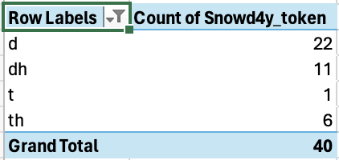
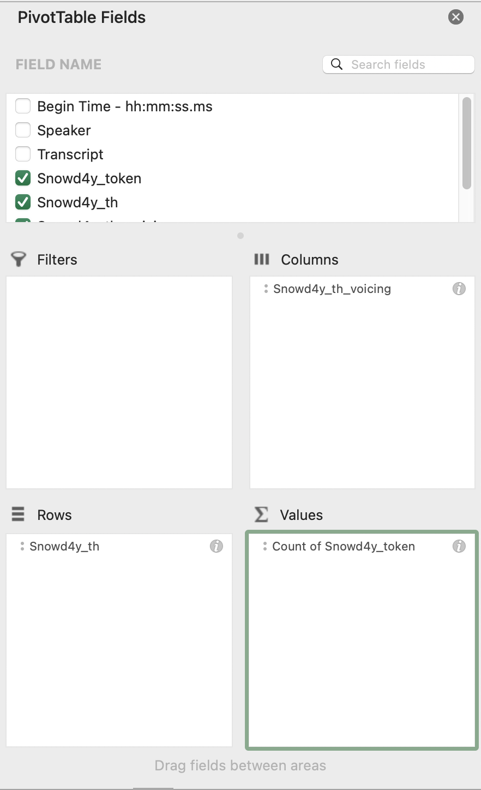
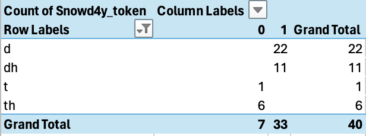
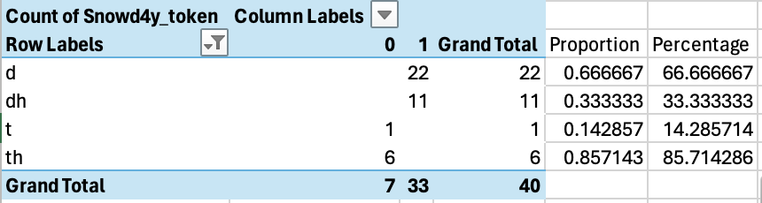

***
### __Creating a PivotTable in Excel__

To show the distribution of your variants based on the independent variables, you can use PivotTables, a valuable Excel tool.

First, open the .txt or .csv file containing your data in Excel. Select all your data. 

  

#### _If you're using the computer version of Excel:_ 

In the __Data__ drop-down menu (the one at the very top of the screen where you also see File, Edit, View, etc.), click "Summarize with PivotTable". Make sure "New worksheet" is selected for the location of your PivotTable; you shouldn't need to change anything else in that pop-up window if you've selected all your data. Click "OK."

A new worksheet will open up. (You'll be able to toggle between this worksheet and the spreadsheet containing all of your data by clicking the little tabs at the bottom of the screen.) You'll now have the power to create PivotTables by checking various columns from the "Field Name" list at the top right of the screen and then dragging them between the "Filters", "Columns", "Rows", and "Values" boxes below. 

For instance, check the boxes for _Snowd4y_token_ and _Snowd4y_th_. Then drag _Snowd4y_th_ into the Rows box, leaving _Count of Snowd4y_token_ in the Values box. Voilà! You should now see a nice summary of your data which counts up the number of (th) tokens that were coded as [d], [ð], [t], and [θ] (as well as __?__ coded) in your section of the interview. You can exclude __?__ coded tokens by clicking the down-arrow button next to "Row Labels" and unchecking __?__. Your PivotTable should now look something like this:

 

Perhaps you want to view the data by voicing. Check the _Snowd4y_th_voicing_ variable and drag it into the "Columns" box. You should now see two columns, _0_ and _1_ (which, if you recall from our coding schema, represent voiceless and voiced). 

Perhaps you want to view the data by position. Uncheck _Snowd4y_th_voicing_ and check _Snowd4y_th_position_, dragging it into the "Columns" box. You should now see a breakdown of the counts by word position.

Perhaps you want to view by both voicing and position. If you have both independent variables checked and in the "Columns" box, you'll see a breakdown based on both. Note that the order in which they appear in the box will affect how they're presented in the PivotTable, so experiment with what order gives you a more effective table.

Perhaps you want to view the data by word. Have _Snowd4y_token_, _Snowd4y_th_, and _Snowd4y_th_position_ checked. Put _Snowd4y_th_ into the "Columns" box, _Snowd4y_th_token_ into the "Rows" box, and _Snowd4y_th_position_ in the "Values" box. You should now see a count of the the number of times each word was pronounced with each possible variant. You can also do this by checking _Snowd4y_th_voicing_ instead of _Snowd4y_th_position_, but if you do so, make sure to click the little "i" button next to _Snowd4y_th_voicing_ in the "Values" box and select "Counts" instead of "Sum". Because we've marked voicing using 0 and 1 values, if "Sum" is selected, all of the voiceless ones marked "0" will be added up as 0 instead of being counted up like we want. 

Feel free to keep experimenting with PivotTables. Knowing how to use them will come in handy if you choose to write your final paper on an analysis of variables from the Snowd4y interview.

 

#### _If you're using the online version of Excel:_

Click the __Insert__ menu (the one next to File, Home, Share, etc.). Click PivotTable. On the right of your screen you should see a list of possible PivotTables automatically suggested. Look through these to find useful breakdowns of the data like those described above. 

You can also create your own PivotTable by looking under "Create your own PivotTable" and clicking "+ New sheet". See above steps for how to create various useful tables.

  

### __Calculating percentages__

Once you have a useful PivotTable, you can calculate percentages or proportions rather than leaving them as counts. For instance, below is a PivotTable setup and output that could be of use:

  

Add a column to the right called "Proportion". In the first cell under "Proportion", which is in the "d" row, type __=SUM(__. Now click on the cell which contains the count of voiced tokens marked as "d" (here, 22). Then type __/__, which indicates division. Now click on the cell which contains the total number of voiced tokens (here, 33). Then type __)__ to complete the formula. Hit ENTER. You should now see the proportion of voiced tokens which are stops.  Do the same for the "dh" row. For the "t" and "th" rows, make sure that what you're dividing by is the total number of voiceless tokens (here, 7).

You can then make a new column to the right called "Percentage" in which you multiply each of the cells in the "Proportion" column by 100 to get the percentages associated with them. This can be done by typing __=SUM(__ then selecting the cell you want to multiply, then typing __*100)__ and then ENTER. You can then drag down the formula to fill it in for the other cells below. Your table may then look something like this:

 

On an actual class paper, you probably wouldn't want to present a screenshot like this, just because you'd want to clean the table up a bit to be more presentable and give the columns and rows better labels. But already, we can see an interesting trend: in this section of the interview, Snowd4y is more likely to use a stop in voiced (th) than in voiceless (th). He uses [d] 67% of the time compared to 33% for [ð], while he uses [t] 14% of the time compared to 86% for [θ].

__For your homework this week,__ create an interesting PivotTable from the interview data that you transcribed (I've described a few possibilities above), and calculate the percentages of interest from the counts - just like what I've presented above. Screenshot the result and submit it along with a short (one or two sentence) interpretation of the data shown - again, just like I've done above in the previous paragraph.
