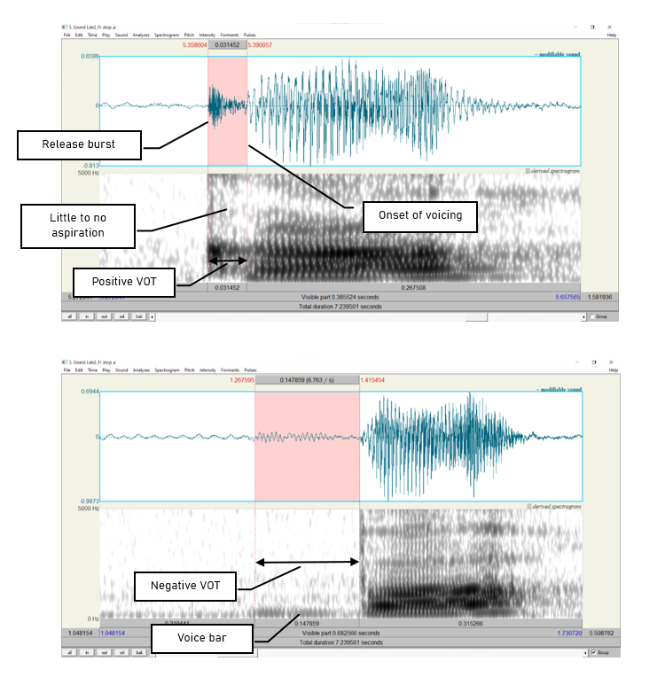
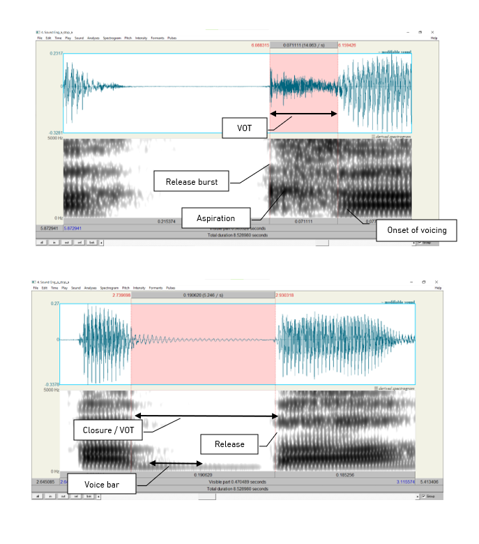

*** 

### __Goal of Lab 2:__

One of the most common acoustic features that is measured and manipulated in speech research is voicing in stop consonants (in particular voice onset time). In this lab, we are going to explore the acoustic correlates of different stop consonants in terms of two parameters: _voicing_ and _place of articulation_. 

***

#### __RECORDING__

Generate the following sound files containing the sequences listed in the right column, and save them with the file names provided in the left column. You may also choose to use the Lab 2 English files contained in our "Lab sound files" folder on eClass. Make sure that in your lab report, you specify whether you recorded the files yourself or chose to use the pre-recorded eClass ones.

|    _File name_       |   _Sounds to record_              |
|:--------------------:|:---------------------------------:|
|Lab2_Eng_stop_a.wav   |  pa, ba, ta, da, ka, ga           |
|Lab2_Eng_a_stop_a.wav |  apa, aba, ata, ada, aka, aga     |
|Lab2_Eng_a_stop.wav   |  lap, lab, bat, bad, rack, rag    |

 
If you are an L1 French speaker, also generate the following sound files. Otherwise, go to eClass and download the Lab 2 French files from our "Lab sound files" folder. Make clear in your lab report whether you've used the pre-recorded files or generated your own. (Don't worry that the pre-recorded a_stop ones are nonce words rather than the real ones I suggest in the right column; the initial consonant shouldn't make much difference in terms of what you'll need to measure for the a_stop files.)

|    _File name_      |   _Sounds to record_                |
|:-------------------:|:-----------------------------------:|
|Lab2_Fr_stop_a.wav   |   pa, ba, ta, da, ka, ga            |
|Lab2_Fr_a_stop_a.wav |   apa, aba, ata, ada, aka, aga      |
|Lab2_Fr_a_stop.wav   |   nappe, nab, latte, lad, sac, vague|

 

Three important acoustic correlates of voicing in stops are:

* The voice bar
* VOT
* The duration of the preceding vowel

 

For each of the stops in each file, take measurements according to the instructions below and fill out Table 2.1, Table 2.2 and Table 2.3 accordingly. Answer the related questions by comparing your measurements across stops.

***

#### __INSTRUCTIONS__

1. Open the following sound files in Praat: __"Eng_stop_a.wav"__ and __"Fr_stop_a.wav"__. Measure the VOT of each stop (see Figure 2.1) and fill in Table 2.1. Compare voiced/voiceless counterparts (p/b, t/d, k/g):

  +	Zoom in so that you can clearly see the transition between the stop and vowel.  
  + Measure the time between the end of the stop closure ( = the beginning of the release burst) and the onset of voicing ( = the onset of regular pitch pulses in the waveform). This is the voice onset time or VOT.  
    + If the onset of voicing __follows__ the release of the stop clouse, then VOT is calculated as __positive__; stops with positive VOT are termed __voiceless__.
      + VOTs of 0ms to about 20ms or 30ms correspond to <u>_voiceless unaspirated stops_</u>.
      + VOTs above 20-30ms correspond to <u>_voiceless aspirated stops_</u>.
    + If the onset of voicing __precedes__ the release of the stop closure, then VOT is calculated as __negative__; stops with negative VOT are termed __prevoiced__ or more generally, __voiced__. (See bottom of Figure 1.2).
    

 

> __TIP:__  
Praat reports time values in seconds, but in phonetic analysis we report in milliseconds, so the values need to be converted. Once you have converted to milliseconds, you do not need to report any decimal places.   Also remember that you might want to change the dynamic range from its default setting of 70dB to 50dB in __Spectrogram > Spectrogram settings__. This helps to remove background noise that might otherwise look like a voicing bar.

 

2. Open the following sound files in Praat: __"Eng_a_stop_a.wav"__ and __"Fr_a_stop_a.wav"__. Note in in Table 2.2 of your report the presence vs. absence of the voice bar (see Figure 2.2) during the stop closure of each consonant and, if present, how long the voice bar lasts.

 

 

3. Open the following sound files in Praat: __"Eng_a_stop.wav"__ and __"Fr_a_stop.wav"__. Measure the duration of the vowel preceding each stop, and fill in Table 2.3 in the report. Compare vowel durations in the voiced vs. voiceless series.

 

> __TIP:__
In order to measure the duration of the vowel, you will need to identify the section of the sound which makes up the vowel. One common means of doing so is to measure where there are clearly visible vowel formants in the spectrogram. You may also find that the waveform helps you see where the vowel's periodic, high-intensity sound waves begin and end. Whatever method you use, the most important thing is to be consistent and use the same method for <u>all</u> your measurements.

***
 

 <h4> __LAB 2 REPORT__ </h4> 
 

You may work in pairs for this lab. On eClass, submit: 1) all .wav files you created for this lab (but not ones you downloaded from eClass) and 2) a PDF with filled-in tables and answers to the questions below. Make sure the PDF file name follows the convention __LING4220_Lab2_LastName_FirstName.pdf__ or, if submitted as a pair, __LING4220_Lab2_LastName1_FirstName1_LastName2_FirstName2.pdf__. If submitting as a pair, only one person in each pair should submit the .wav and .pdf files.

 _Table 2.1 VOT_ 

|                              |  p   |   b  |   t  |   d  |   k  |   g  |
|:-----------------------------|:----:|:----:|:----:|:----:|:----:|:----:|
|English VOT (ms) (Eng_stop_a) |      |      |      |      |      |      |
|French VOT (ms) (Fr_stop_a)   |      |      |      |      |      |      |

 

__Q1:__ How does VOT differ between voiced vs. voiceless stops? How do English and French seem to differ in terms of how they use VOT as a cue to voiced vs. voiceless stops?

 

 _Table 2.2 Voice bar_ 

|                                     |                       |  p   |   b  |   t  |   d  |   k  |   g  |
|:------------------------------------|:----------------------|:----:|:----:|:----:|:----:|:----:|:----:|
|English voice bar (ms) (Eng_a_stop_a)|Is it there?           |      |      |      |      |      |      |
|                                     |How long does it last? |      |      |      |      |      |      |
|French voice bar (ms) (Fr_a_stop_a)  |Is it there?           |      |      |      |      |      |      |
|                                     |How long does it last? |      |      |      |      |      |      |

 

__Q2:__ If the voice bar is present at all, does it last through the duration of the closure? Why do you think it might go away?

__Q3:__ What differences (if any) do you observe in the voice bar between English and French?

 

 _Table 2.3 Preceding V duration_ 

|                                               |  p   |   b  |   t  |   d  |   k  |   g  |
|:----------------------------------------------|:----:|:----:|:----:|:----:|:----:|:----:|
|English preceding V duration (ms) (Eng_a_stop) |      |      |      |      |      |      |
|French preceding V duration (ms) (Eng_a_stop)  |      |      |      |      |      |      |

 

__Q4:__ How does the duration of the preceding vowel differ depending on the voicing of the following consonant?

__Q5:__ What differences (if any) do you observe in the preceding vowel duration between English and French?

__Q6:__ Based on what you’ve seen in this lab, summarize the possible acoustic correlates of the phonemic voicing contrast (voiced vs. voiceless) across languages.

 

 <h4> __REFERENCES__ </h4> 
  

__Q7:__ Provide a reference and very brief (one paragraph) summary of one academic paper that uses the methods covered in this lab.

 

***

 Disclaimer: The original lab materials on which this lab is based were put together in 2015 (updated 2019) by Sonya Bird, Qian Wang, Sky Onosson, and Allison Benner for the LING 380 Acoustic Phonetics course at the University of Victoria. Their materials are released under a Creative Commons license (CC BY-NC-SA 4.0) which allows for non-commercial use as well as copying and distribution and the creation of derivative works for non-commercial purposes. Thomas Kettig (with assistance from Taylor Potter) has modified these materials as needed for the York University LING 4220 Acoustic Phonetics course.

 