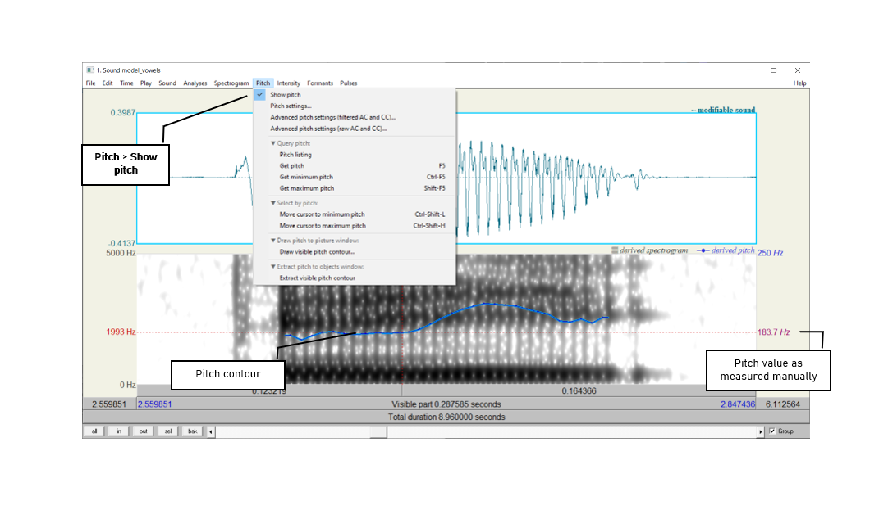
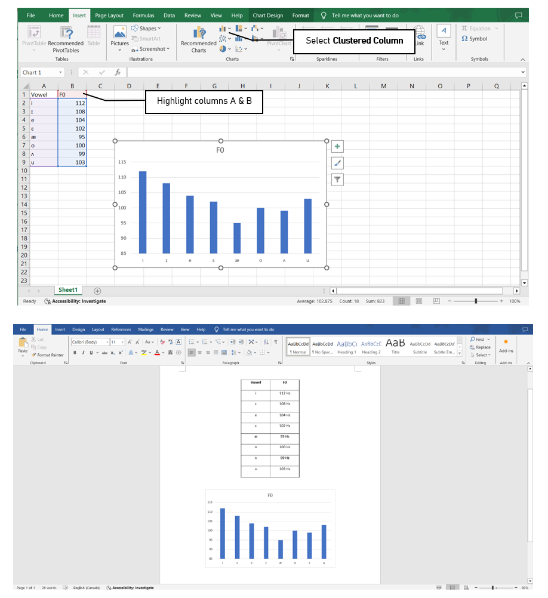
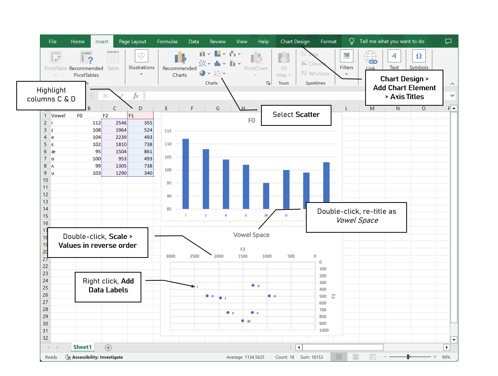

***

### __Goal of Lab 3:__

In this lab, we are going to explore vowel properties: _intrinsic pitch_ and _spectral make-up (formant structure)_. 

***

#### __RECORDING__

Record a single sound file with one repetition each of the following words, and save it as __"Lab3_EnglishVowels"__:  

 _beat, bit, bait, bet, bat, boat, but, boot_.
  

 

Try to use a level (monotone) pitch throughout each of the vowels. __Do not use your typical English listing intonation.__ Pretend you are a robot and try to hold your pitch as constant as possible both within and between words. This will be easiest if you pause between vowels, rather than uttering the sequence of vowels as if it were part of a sentence.

 
Take a quick look at your vowels in the View & Edit window, and make sure you can clearly see the vowel formants (see Lab 1 on formant display). If you have trouble seeing them, you can download the file __"Lab3_ EnglishVowels.wav"__ from eClass and take your measurements on this file. If you do this, please make a note of it on your report.

***

#### __INSTRUCTIONS__

1. When filling out Table 3.1 and 3.2, ensure that you use the appropriate IPA symbols for each vowel on the top row.  

 

#### __SECTION I. INTRINSIC PITCH__

2. Measure the pitch (F0) in each of the vowels (see Figure 3.1). Note down your measurements in Table 3.1. Note that measurements should be rounded to the nearest whole number unit – no decimal points!

* Display the pitch track: __Pitch > Show pitch__
* Click on the blue pitch track in the middle, stable portion of the vowel
* A red horizontal bar should appear, with the pitch value (dark red) on the right side of the window: note down this value in Table 3.1.

 

> __TIP:__  
The fundamental frequency value is always displayed on the <u>right</u> side of the window in dark red text (or, on some older versions of Praat, blue text); formant frequencies are displayed on the <u>left</u> side in bright red text – be careful not to get these two confused! 
>
If the blue pitch contour (blue line) doesn’t appear clearly, it is because Praat’s default pitch range is not appropriate for the file you’re listening to.

 

* Go to __Pitch > Pitch settings...__
* Adjust the pitch range to see the pitch contor clearly:
  + If you have a very high voice, you may need to adjust the range __upwards__.
  + If you have a very low voice, you may need to adjust the range __downwards__.
  

 

> __TIP:__  
If you are male, your pitch ought to be somewhere between 90 Hz and 150 Hz.  
>
If you are female, it should be somewhere between 150 Hz and 250 Hz. 
>
If the pitch values that you are getting are outside of these ranges, Praat might be making a measurement error. You can confirm your pitch measurement by zooming in to a very small section of the waveform and manually measuring the duration of one glottal cycle. See Lab 4 for further details. 
>
Also ensure that your 'analysis method' under Pitch settings is set to <u>raw autocorrelation</u> to get the correct display for the pitch contours.

 

3. Use the confirmed pitch values from Table 3.1 to generate a chart in Excel.

* Open a new spreadsheet in Excel: enter the IPA symbols for each vowel in column A, and your pitch (F0) measurements in column B (see Figure 3.2)
* Select (highlight) columns A and B and create a chart: __Insert > 2-D Column > Clustered column__
* Copy and paste the chart into a Word document for your lab report to display alongside Table 3.1.

 

Do note that the column chart can be made in other word processors such as Google Sheets and the free browser version of Excel. However, there is some difficulty with making the upcoming cluster chart in these programs. It would be easier to use the desktop version of Excel and follow the instructions below. As York students, you can easily access this version for free via MyApps which can be found [here](https://www.yorku.ca/uit/faculty-staff-services/myapps/). 

* Log in to your Passport York in the MyApps portal - use only the first half of your email for the 'Username' portion.
* Click on __your Profile > Download the client__.
* Install AppsAnywhere on your device.
* On the MyApps website, click 'View all apps'.
* Open __Excel__.

 

#### __SECTION II. SPECTRAL MAKE-UP (FORMANT VALUES)__

4. Now focus on the spectrogram and measure the first and second formants (F1 and F2) of each vowel (see Figure 3.3). Enter the obtained values in Table 3.2. Note that measurements should be rounded to the nearest whole number – no decimal points!

* Display the formant track: __Formant > Show formants__
* Place your cursor in the centre of each formant, in the middle of the vowel. If your "bait" and "boat" vowels are very diphthongal, you may want to measure these around one-third of the way through the vowel (closer to the beginning) rather than at the midpoint.
* A red horizontal bar should appear, with the frequency value on the left side of the window, in red

 

> __TIP:__
It is not always easy locating formants. Don’t get discouraged, just do the best you can!

 

5. Enter the formant values into the Excel spreadsheet you created in 3 above, and create your vowel plot (see Figure 3.4).

* Calculate and enter the value of __F2__ for each vowel in column C, and enter the __F1__ value in column D.
* Select (highlight) columns C and D and create a scatterplot: __Insert > Scatter__
* Reverse the order of both axes by right-clicking on each axis to open Format Axis: and check the box beside __Values in reverse order__
* Double-click on the plot title and enter __Vowel Space__
* Create the titles __F2__ for the x-axis and __F1__ for the y-axis: __Chart Design > Add Chart Element > Axis Titles__
* Create labels for your data points: Right-click on any datapoint in the plot and select __Add Data Labels__
  + By default, the labels will display the y-axis value (F1); click on the displayed value and re-enter the applicable IPA vowel symbol
  
 

> __TIP:__
It can be somewhat tricky to click precisely on the data label; try increasing the zoom level of the display to 150 or 200%.

 

6. Copy and paste your chart and data into your lab report as in Section I.

 

***

***
 

 <h4> __LAB 3 REPORT__ </h4>
 

 <h4> __SECTION I. INTRINSIC PITCH__ </h4> 
 

You may work in pairs for this lab. On eClass, submit: 1) the .wav file you created for this lab (but not the one you downloaded from eClass, if you chose to use that) and 2) a PDF with filled-in tables and answers to the questions below. Make sure the PDF file name follows the convention __LING4220_Lab3_LastName_FirstName.pdf__ or, if submitted as a pair, __LING4220_Lab3_LastName1_FirstName1_LastName2_FirstName2.pdf__. If submitting as a pair, only one person in each pair should submit the .wav and .pdf files. Remember to always add unit labels (Hz, ms, etc.) to all your tables and figures.

 _Table 3.1 Intrinsic vowel pitches (F0)_ 

| Method                 | [ ]  | [ ]  |  [ ] |  [ ] |  [ ] |  [ ] | [ ] | [ ]  |
|:-----------------------|:----:|:----:|:----:|:----:|:----:|:----:|:---:|:----:|
|Manual measurement      |      |      |      |      |      |      |     |      |

__Q1:__ Is pitch the same across all vowels? Do you notice any patterns with it?

 

 <h4> __SECTION II. SPECTRAL MAKE-UP (FORMANT VALUES)__ </h4> 

 _Table 3.2 Vowel formants_ 

| Formant       | [ ]  | [ ]  |  [ ] |  [ ] |  [ ] |  [ ] | [ ] | [ ]  |
|:--------------|:----:|:----:|:----:|:----:|:----:|:----:|:---:|:----:|
|F1 (Hz)        |      |      |      |      |      |      |     |      |
|F2 (Hz)        |      |      |      |      |      |      |     |      |

__Q2:__ Look at the formant values associated with different vowels:

  a. Why do formants differ across vowels?
  b. What does F1 seem to correspond to, in terms of articulation?
  c. What about F2?
  
 

__Q3:__ Does your vowel chart look as you expected that it would, based on similar ones you may have encountered in your previous courses/textbook(s)? Note anything that strikes you about your vowel chart as being unusual, or different from your expectations.

 

__Q4:__ In this lab, you should take all of your measurements in approximately the same spot (except potentially for diphthongs). What spot is this, and why? Why would this spot potentially be problematic for diphthongs?

 

 <h4> __REFERENCES__ </h4>

__Q5:__ Provide a reference and very brief summary of one academic paper that uses the methods covered in this lab.

***

 Disclaimer: The original lab materials on which this lab is based was put together in 2015 (updated 2019) by Sonya Bird, Qian Wang, Sky Onosson, and Allison Benner for the LING 380 Acoustic Phonetics course at the University of Victoria. Their materials are released under a Creative Commons license (CC BY-NC-SA 4.0) which allows for non-commercial use as well as copying and distribution and the creation of derivative works for non-commercial purposes. Thomas Kettig (with assistance from Taylor Potter) has modified these materials as needed for the York University LING 4220 Acoustic Phonetics course.

 
