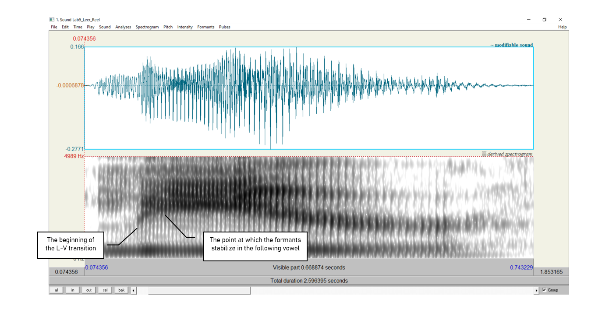
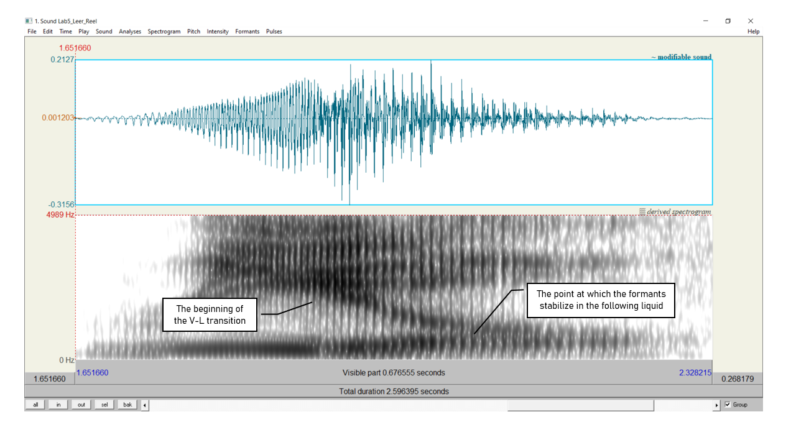

***

### __Goal of Lab 5:__
 Sonorants are:

* similar to vowels in that they have formants
* different from vowels in that they are generally lower amplitude (and behave as consonants phonologically)

In this lab, we are going to explore the acoustic correlates of two types of sonorants: _glides_ [w j] and _liquids_ [ɹ l]. 

***

#### __OBTAIN FILES__

Go to eClass and download the following Lab 5 files. Note, you could also generate these yourself, but I have done it for you here to make sure that the sound files are clear enough for taking measurements.

| _File name_         | _Words_      |
|:-------------------:|:------------:|
|Lab5_We_You.wav      |  we, you     |
|Lab5_Leer_Reel.wav   |  leer, reel  |

 

***

#### __INSTRUCTIONS__
#### __SECTION I. GLIDES__

 

1. Open the file __Lab5_We_You.wav__. Follow the instructions below and fill in Table 5.1 on the acoustic correlates of different glides.

 

<u> A. Formants </u>

* In Table 5.1, note down the frequency of F1, F2 and F3 for each glide, as measured around the midpoint of the glide. The midpoint of __[w]__ should be at about __0.23s__ and the midpoint of __[j]__ should be at about __1.55s__. For the measurements of formants in this section, you'll want to turn __on__ formant tracking (_Formants > Show formants_).

> __TIP:__
My voice works best with formant tracking set to a ceiling of 5000 Hz, and the rest of the settings at default/standard. Double check these settings each time you open each of the files for this lab.

<u> B. Formant transitions </u>

* In Table 5.1, either draw stylized lines to indicate the F1, F2 and F3 contours throughout each Glide-Vowel sequence, or briefly describe in prose the path of the contours that you observe.

 

***

#### __SECTION II. LIQUIDS__

 

2. Open the file __Lab5_Leer_Reel.wav__. Follow the instructions below and fill in Table 5.2 on the acoustic correlates of different liquids.

 

<u> A. Formants </u>

Certain sounds are pronounced differently in onset vs. coda position, including liquids. For the measurements of formants in this section, you'll also want to turn __on__ formant tracking (_Formants > Show formants_).

First consider the onset [ɹ] and [l]. (Think back to your phonology classes: you'll find the onset [ɹ] in "reel" and the onset [l] in "leer").

* In Table 5.2, note down the frequency of F1, F2 and F3 for each onset liquid, as measured around the liquid's midpoint. (Finding a midpoint requires figuring out a start and end point, but that's sometimes tough due to transition zones. But a good measurement spot for onset __[ɹ]__ should be at about __1.74s__ and for onset __[l]__ at about __0.12s__.)

Now, consider the coda [ɹ] and [l].

* In Table 5.2, note down the frequency of F1, F2 and F3 for each liquid, as measured around the midpoint of the coda liquid. (Again, finding a midpoint requires figuring out a start and end point, but it's hard to find a single place where each liquid coda starts since there's less of a starting point than a transition zone. A good measurement spot for coda __[ɹ]__ should be at about __0.56s__ and for __[l]__ at about __2.17s__.)

<u> B. Formant transition shapes </u>

Consider the __coda__ [ɹ] and [l] transition zones:

* In Table 5.2, draw lines to indicate the F1, F2 and F3 contours throughout each vowel-liquid sequence, or describe them in prose.

<u> C. Formant transition durations: Onsets vs. Codas </u>

In this last part, you will compare the _duration_ of liquids across syllabic positions. You may want to turn __off__ formant tracking for this section and instead eyeball the spectrogram's dark streaks.

* __Onset__: Consider the onset [ɹ] and [l]. Measure the duration from the beginning of the liquid-vowel transition (where the formants start to move) to the point at which the formants stabilize in the following vowel. That is, the transition zone will be a region where at least one formant looks very diagonal rather than basically horizontal (see Figure 5.1 for an example). Note down your measurement in Table 5.2.

 

* __Coda__: Use the coda [ɹ] and [l] for these measurements. Measure the duration between the beginning of the vowel-liquid transition (where the formants start to move) to the point at which the formants stabilize in the following liquid - again, where one or more formants looks strikingly diagonal rather than basically horizontal (see Figure 5.2). Note down your measurement in Table 5.2.

 

***

***
 

 <h4> __LAB 5 REPORT__ </h4> 
 

 <h4> __SECTION I. GLIDES__ </h4> 
 

 _Table 5.1 Acoustic correlates of glides_ 

|                                   |   [w]          |      [j]         |
|:----------------------------------|:---------------|:-----------------|
|Formants (Glides)                  |F1:             |F1:               |
|                                   |F2:             |F2:               |
|                                   |F3:             |F3:               |
|Formant transitions (Glide-Vowel) as a drawing or a brief description |                |                  |

 

__Q1:__ Look at the formant structure of the glides: which vowel does each glide resemble?

__Q2:__ What differences do you note between the two glide-vowel contours, i.e. between the transitions out of the two glides? Articulatorily, what do you think causes these differences, and how are these articulatory differences reflected in the acoustics?

 

 <h4> __SECTION II. LIQUIDS__ </h4> 

 _Table 5.2 Acoustic correlates of liquids_ 

|                                   |   [ɹ]          |      [l]         |
|:----------------------------------|:---------------|:-----------------|
|Formants (Liquids) in onset        |F1:             |F1:               |
|                                   |F2:             |F2:               |
|                                   |F3:             |F3:               |
|Formants (Liquids) in coda         |F1:             |F1:               |
|                                   |F2:             |F2:               |
|                                   |F3:             |F3:               |
|Formant transitions (vowel-liquid) as a drawing or a brief description|                |                  |
|Formant transition duration        |Onset:          |Onset:            |
|                                   |Coda:           |Coda:             |

 

__Q3:__ Which formant is most strikingly different between the two liquids?

__Q4:__ Describe the differences you see between the two vowel-liquid contours, i.e. between the transitions into the two liquids.

__Q5:__ Compare the transition durations in onset vs. coda position (ɹi vs. iɹ and li vs. il): which transitions are longer, onset or coda?

__Q6:__ Think about **articulatory** differences between /l/ in onset vs. coda position. Given what you know about these differences (think of the **allophones** of /l/ in English), do you expect any acoustic differences? If so, do your observations match your expectations?

 

 <h4> __REFERENCES__ </h4> 

__Q7:__ Provide a reference and very brief summary of one academic paper that uses the methods covered in this lab.

***

 Disclaimer: The original lab materials on which this lab is based was put together in 2015 (updated 2019) by Sonya Bird, Qian Wang, Sky Onosson, and Allison Benner for the LING 380 Acoustic Phonetics course at the University of Victoria. Their materials are released under a Creative Commons license (CC BY-NC-SA 4.0) which allows for non-commercial use as well as copying and distribution and the creation of derivative works for non-commercial purposes. Thomas Kettig (with assistance from Taylor Potter) has modified these materials as needed for the York University LING 4220 Acoustic Phonetics course.

 
