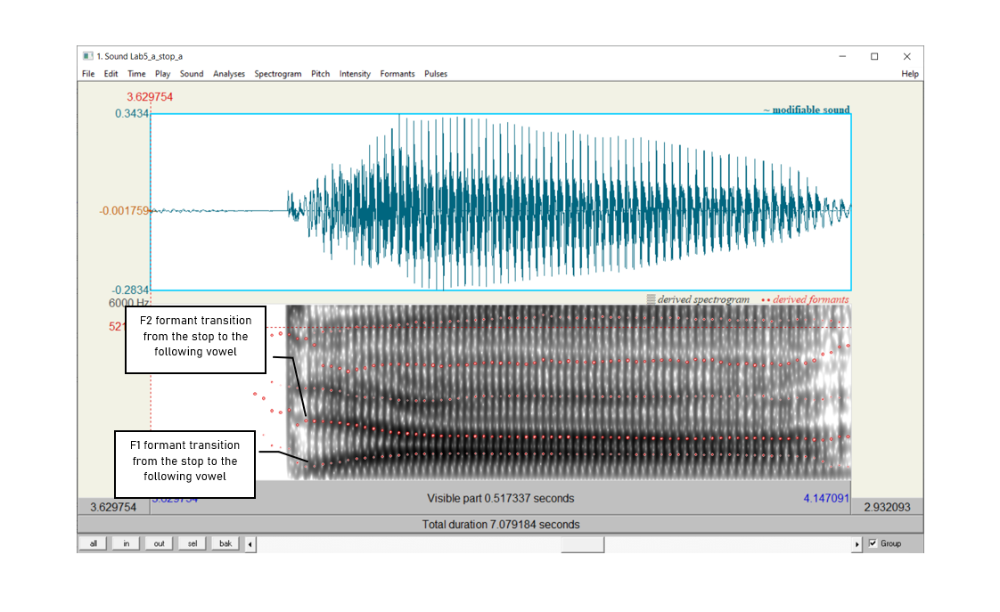
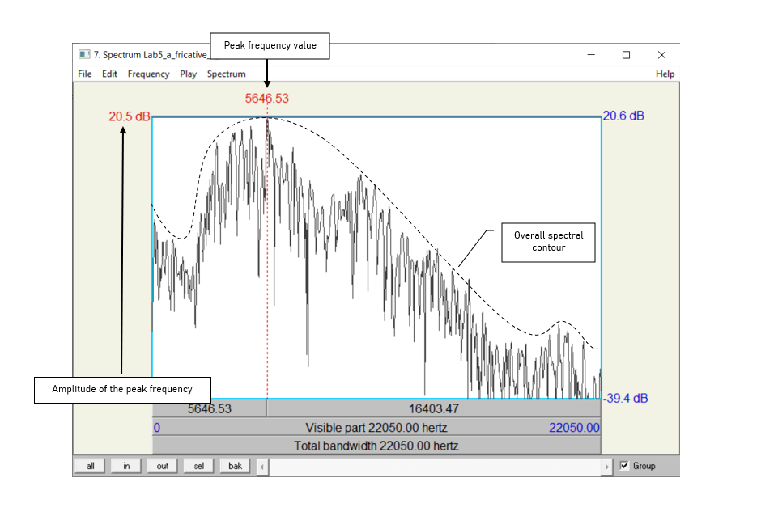

***

### __Goal of Lab 6:__
 In this lab, we are going to explore the acoustic correlates of _obstruent place of articulation_. We shall see that the location of these correlates differ in stops vs. fricatives: while they are mainly “intrinsic” (within the consonant) for fricatives, they are mainly “extrinsic” (in the transitions to adjacent vowels) for stops. 

***

#### __RECORDING__

Go to eClass and download the Lab6 sound files listed in the table below.

| _File name_            | _Sounds to record_             |
|:----------------------:|:------------------------------:|
|Lab6_a_stop_a.wav       |  apa, aba, ata, ada, aka, aga  |
|Lab6_i_stop_i.wav       |  ipi ibi, iti, idi iki, igi    |
|Lab6_a_fricative_a.wav  |  afa, aθa, asa, aʃa, aha       |

 

***

#### __INSTRUCTIONS__
#### __SECTION I. STOP CONSONANTS__

Several acoustic correlates distinguish different places of articulation in stops. The main ones are:

* VOT
* Spectral pattern during aspiration (voiceless stops)
* Transition into the adjacent vowels

 

We will focus on formant transitions in this section. Focus on the differences associated with place of articulation (i.e. the differences between /p b/, /t d/ and /k g/.

* Open the following sound files in Praat: __"Lab6_a_stop_a.wav"__ and __"Lab6_i_stop_i.wav"__  
* Focus on the __voiced__ stops for now.

 

1. In Table 6.1, note the F2 formant transition shape (and F1 if you can see it) between each voiced stop and the _following_ [a] or [i] vowel (see Figure 6.1). Zoom so that you can clearly see the formant transitions from the stop into the following vowel. (I find that zooming in too close our zooming out too far make doing this difficult, so if you have about 0.5 to about 1 second visible in your window, that should be good.)

2. Note the movement contour of __F2__ (and F1 if you can see it) into the _following_ vowel. You can make a little sketch, or describe the shape in words.

 

 

***

#### __SECTION II. FRICATIVES__

Different places of articulation in fricatives are correlated with two main properties: spectral content and relative amplitude. By examining the overall spectral contour, peak frequency and the amplitude of peak frequency, we can have an idea of the properties of a fricative.

 

3. Use Table 6.2 to fill in the measurements you take on these three dimensions and compare between fricatives of different POA.  

 

For this portion of the lab, make sure that the spectrogram is set to display frequencies up to
__9,000 Hz__:

* Spectrum > Spectrogram settings...
* View range: up to 9,000 Hz
* Open the following sound file in Praat: __Lab6_a_fricative_a.wav__
* Select approximately __50-60ms__ in the middle of each fricative (where the sound is most stable)
* __Spectrum > View spectral slice__  

* For each fricative:
  + [Take a screenshot](https://www.take-a-screenshot.org/) of the spectral slice and paste it into your lab document. Be sure to give the spectral slice an appropriate title.
  + Note down the __spectral peak__ in Table 6.2: the frequency or frequencies around which most of the energy is centered, i.e. the highest amplitude frequencies (the highest peaks)
  + Note down the __amplitude__ of the peak frequency in Table 6.2 (this is the amplitude of the frequency noted in the previous bullet point). Note that the positive dB values are louder than the negative dB values.

 

> __TIP__:  
You can also get a good idea of the frequency ranges and their relative amplitudes by looking at the spectrogram.
>
For English, 'ballpark' measurements for [s] will be around 9,000Hz or higher, and for [ʃ] will be somewhere close to 5,000Hz. This will vary speaker by speaker, though.

 

***

***
 

 <h4> __LAB 6 REPORT__ </h4> 
 

 <h4> __SECTION I. STOPS__ </h4> 
 

 _Table 6.1 Acoustic correlates of place of articulation in stops: formant transitions_ 

|  Correlate             |  Stops      |  [b]  |  [d]  |  [g]  |
|:----------------------:|:-----------:|:-----:|:-----:|:-----:|
|1. Formant transitions  | [i] context |       |       |       |
|                        | [a] context |       |       |       |

Describe or do a basic sketch of the F2 transition (and F1, if visible) from these voiced stops into the __following__ vowel. 
 

__Q1:__ How do the different places of articulation differ with respect to the F2 transitions into the following vowels? What causes these differences by place of articulation?

__Q2:__ Looking specifically at [ada] and [idi], do you notice a difference in the formant transitions? What do you think causes this difference?

 

 <h4> __SECTION II. FRICATIVES__ </h4> 
 

 _Table 6.2 Acoustic correlates of place of articulation in fricatives_ 

|     |  Peak frequency (Hz)  |  Amplitude of peak frequency  |
|:---:|:---------------------:|:-----------------------------:|
| [f] |                       |                               |
| [θ] |                       |                               |
| [s] |                       |                               |
| [ʃ] |                       |                               |
| [h] |                       |                               |

 

__Q3:__ Among the fricatives you measured, which ones are highest/lowest in amplitude? What do you think is the articulatory reason for this?

__Q4:__ Compare the spectral peaks of [s] vs. [ʃ]. Articulatorily, what do you think causes the difference between these two fricatives?

  

 <h4> __REFERENCES__ </h4> 
 

__Q5:__ Provide a reference and very brief summary of one academic paper that uses the methods covered in this lab.

***

 Disclaimer: The original lab materials on which this lab is based was put together in 2015 (updated 2019) by Sonya Bird, Qian Wang, Sky Onosson, and Allison Benner for the LING 380 Acoustic Phonetics course at the University of Victoria. Their materials are released under a Creative Commons license (CC BY-NC-SA 4.0) which allows for non-commercial use as well as copying and distribution and the creation of derivative works for non-commercial purposes. Thomas Kettig (with assistance from Taylor Potter) has modified these materials as needed for the York University LING 4220 Acoustic Phonetics course.

 

