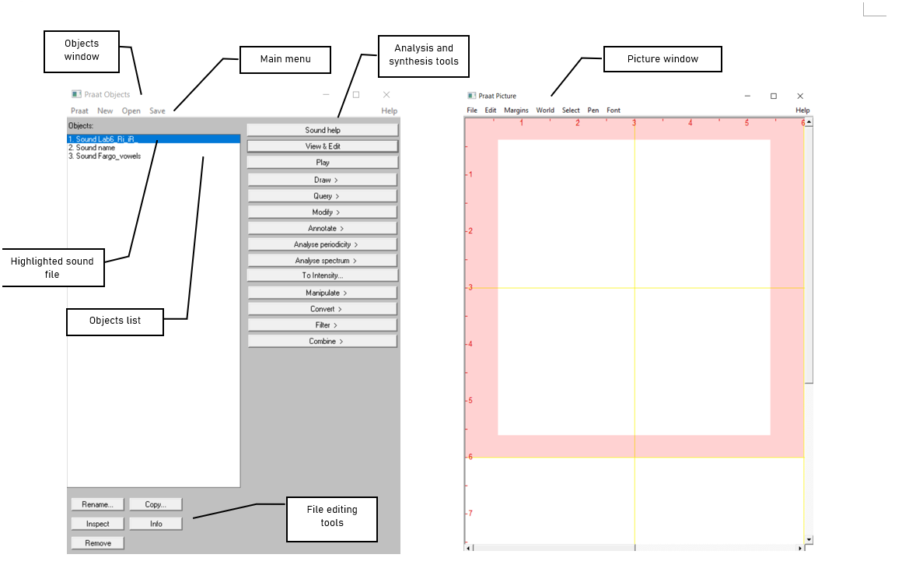
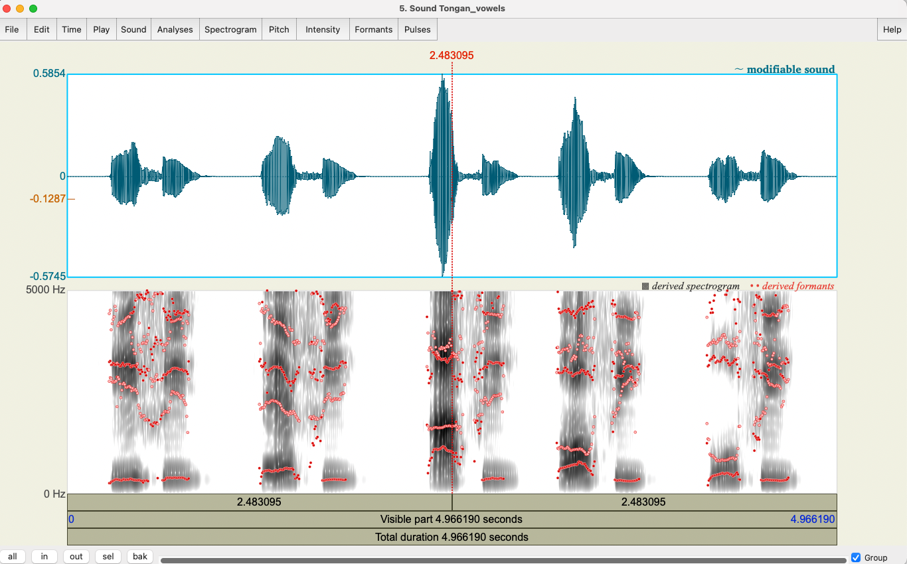
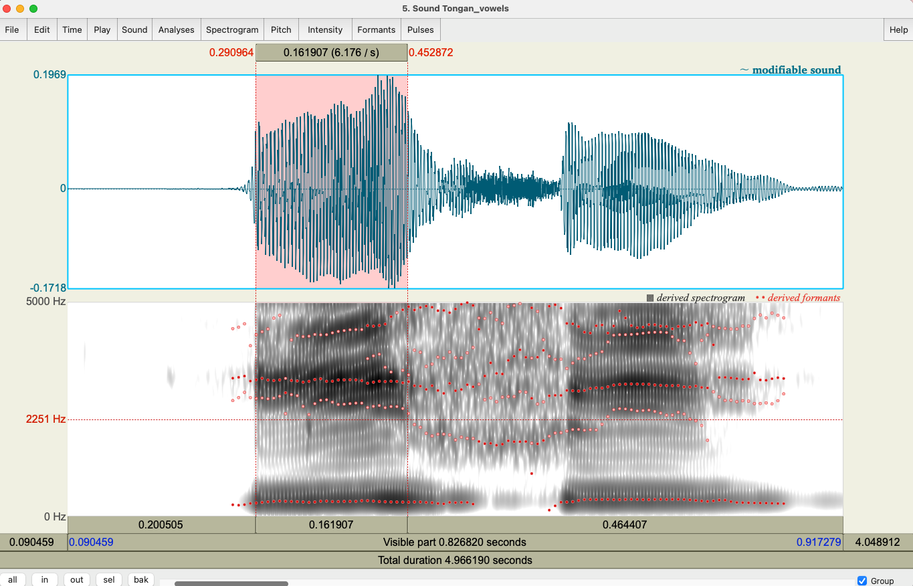
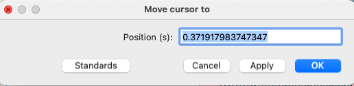
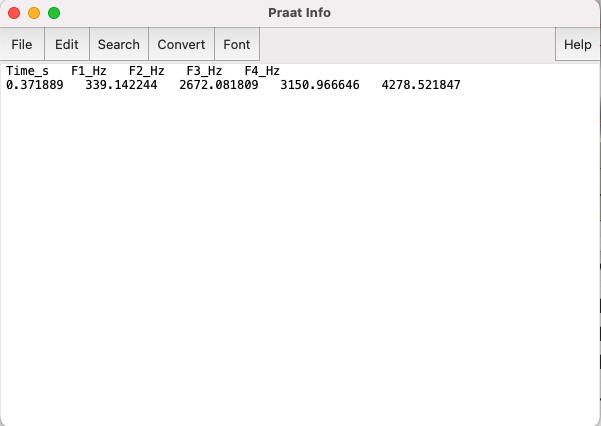
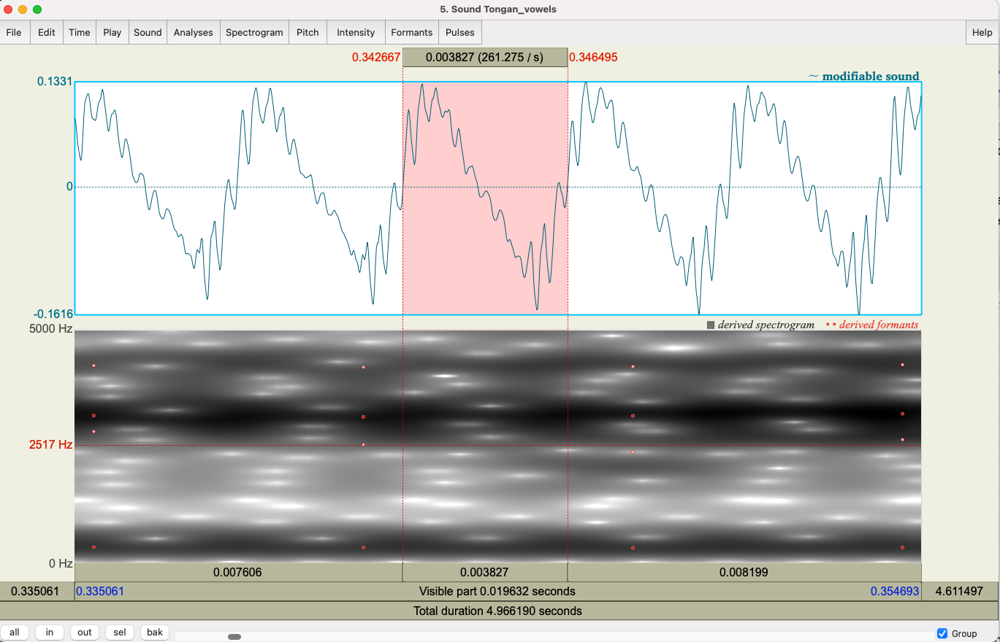

***
### __Goal of Tutorial 1:__

The goal of this first tutorial is to explore some of the basic features of [PRAAT](www.praat.org). You will learn how to open a recording in order to see its spectrogram and waveform; measure the F1 and F2 of vowels; and make a plot of F1/F2 measurements to show a vowel space. 

***

 

1. Open Praat by double clicking on the following icon:

 

2. Get to know the Praat layout. You can usually close the Picture Window when you start Praat; most of the action usually happens in the Objects Window.

 

3. Download the _Tongan_vowels.wav_ file from eClass. Open it by navigating to _Open_ > _Read from file..._ in the Objects Window. (__Ctrl/Cmd + O__ is the shortcut to open a file when you're viewing the Objects Window.)

4. In the Objects window, select the Tongan_vowels sound by clicking it. Click __View & Edit__ on the “Analysis and synthesis tools” panel.

Two things are being displayed now in the Edit window: **the waveform** on the upper level and **the spectrogram** on the lower level.

 

5. When you first open a sound file in the View & Edit window, it may seem a bit more of a mess than the above picture. Depending on the default settings in the version of Praat you are using, you may see vertical lines in the waveform, and in the spectrogram there might be lines of red dots or a blue or yellow line. You can tidy up the visual display by doing the following: 

In the menu of the View & Edit window:

* __Pitch > Show pitch__ (click on this to select or unselect it)
* __Intensity > Show intensity__ (click on this to select or unselect it)
* __Formant > Show formants__ (click on this to select or unselect it)
* __Pulses > Show pulses__ (click on this to select or unselect it)
  

For this tutorial, let's have all of these unselected except for "Show formants". With only formants shown, you should see something like the above picture, with only red dots in the spectrogram. 

> __TIPS:__   
> Below are some common manipulations you will find useful.
>
><u> Selecting a portion of the sound file and measure the duration of the portion</u>
>
1. To select a portion of the sound file, place the cursor on the starting point on the waveform or spectrogram and drag the mouse over the portion you are interested in.  
2. The number in black at the top and bottom of the display indicates the duration of the selection. The two red numbers on each side of the selection (on the top only) indicate the starting and ending time of the selection.
>  
> <u> Zooming into a portion of the sound file </u>
>
1. To zoom into a specific portion of the sound file, select it first and click “sel” in the zoom options panel.  
2. You can also use the “in” and “out” buttons in the zoom options panel to zoom in or zoom out within the sound file. This will zoom the file around the center point of the window display, regardless of where your cursor is.
>  
><u> Listening to a sound file </u>
>
1. In the View & Edit Window, you can listen to the sound file or a portion thereof by clicking on one of the panels at the bottom of the display.
>
><u> Better settings for spectrogram readings </u>
>
1. Go to __Spectrogram > Spectrogram settings__
2. Change the Dynamic range (dB) from its default setting of 70.0 to 50.0 - this helps to remove background noise and isolate the voice in the recording
>
>Along with these, Praat supports various [keyboard shortcuts](https://www.fon.hum.uva.nl/praat/manual/Keyboard_shortcuts.html) to help streamline this process. Some of the shortcuts that may be useful for this tutorial are:
>
* __TAB__ - plays and pauses the recording
* __Ctrl/Cmd + N__ - zoom in to selection
* __Ctrl/Cmd + I__ - zoom in to midpoint of visible window
* __Ctrl/Cmd + O__ - zoom out a bit
* __Ctrl/Cmd + A__ - zoom out to full sound

 

6. Play the full sound file by Zooming all the way out with the keyboard shortcut __Ctrl/Cmd + A__, clicking the beginning of the sound, and pressing the __TAB__ buttom once on your keyboard. You should hear the speaker saying the Tongan words:

 _ifi, efe, afi, ofi, ufi_.

We'll now begin our measurements of the Tongan vowel system.

7. Zoom into _ifi_ and select the first /i/ vowel. The beginning and ending of a vowel is usually based on where F2 begins and ends. Look closely at the spectrogram to identify those beginning and end points.

8. To move cursor the midpoint of the selection, click _Time_ then _Move cursor to…_. The midpoint will automatically be calculcated. Click _OK_.

  

 

9. To determine the formant values at that point, click _Formant_ then _Formant listing_. The first number in the window is the timepoint where the formant values were calculated. The next four numbers are F1-F4. 

 

10. Download the Tongan_vowels_template.xlsx file and open it (or open the file in the web browswer version of Excel that you have access to through your YorkU account). This is where you're going to input the F1 and F2 readings from each of the vowels.

Enter the F1 and F2 of the /i/ midpoint you just found into the appropriate columns of the Excel spreadsheet. Round the numbers to the nearest Hz unit (no decimals needed).

11. Repeat the process of measuring each of the word-initial vowels until your table is complete. By completing the table, you should also be completing the vowel space. If you'd like, you can save your Tongan vowel space Excel file and email it to yourself as a souvenir.

12. Bonus: If you still have time, Determine the fundamental frequency (pitch) of one of the vowels. Zoom in to one of the vowels until you can view about five cycles.
Drag the cursor from the beginning of one cycle to the end. Above the selection is the duration of the selected portion, in seconds.
Calculate the frequency.

 

***
