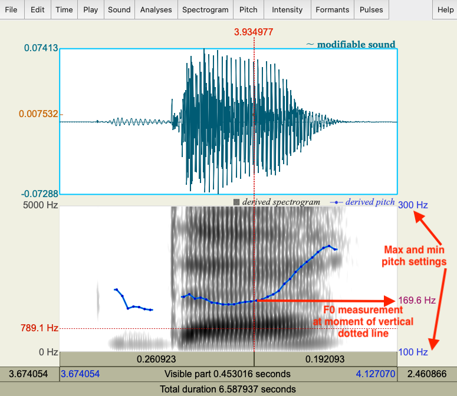
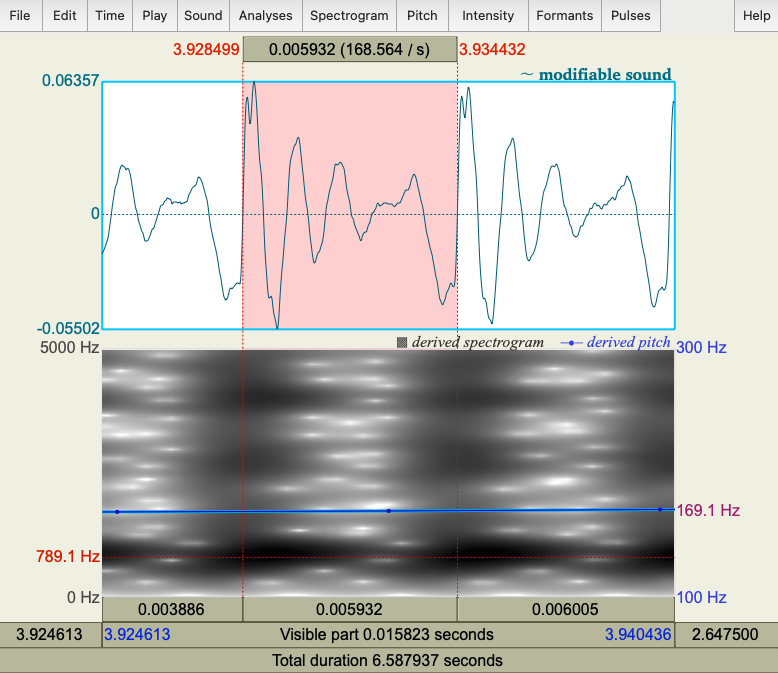

*** 

### __Goal of Tutorial 2:__

In this tutorial, you will explore how to measure _Voice Onset Time (VOT)_, one of the main acoustic correlates of plosive _voicing_. Languages differ in how they implement voicing distinctions, so you will be measuring both English and French consonants in order to compare them. VOT is typically measured in seconds or milliseconds.

You'll also be learning how to measure the _fundamental frequency_ of vowels, also known as _F0_. This is the number of times per second (measured in Hz) that the overall waveform cycle repeats, and it is perceived auditorily as _pitch_.

***

#### __INSTRUCTIONS__

##### __Part 1: Measuring VOT__

1. Download __Tutorial2_measurements.xlsx__ from eClass and open it in Excel.

2. Download __Tutorial2_Eng_stop_a.wav__ from eClass and open the sound in Praat. Select it in the Objects Window and click _View and Edit_.

Take a listen to the syllables spoken in the file. You should hear __"pa ba ta da ka ga"__.

  +	Zoom in so that you can clearly see the transition between the stop and vowel.  
  + Measure the time between the end of the stop closure ( = the beginning of the release burst) and the onset of voicing ( = the onset of regular pitch pulses in the waveform). This is the voice onset time or VOT.  
    + If the onset of voicing __follows__ the release of the stop closure, then VOT is calculated as __positive__; stops with positive VOT are termed __voiceless__.
      + VOTs of 0ms to about 20ms or 30ms correspond to <u>_voiceless unaspirated stops_</u>.
      + VOTs above 20-30ms correspond to <u>_voiceless aspirated stops_</u>.
    + If the onset of voicing __precedes__ the release of the stop closure, then VOT is calculated as __negative__; stops with negative VOT are termed __prevoiced__ or more generally, __voiced__.
    

 

> __TIP:__  
Praat reports time values in seconds, but in phonetic analysis we report in milliseconds, so the values need to be converted. Once you have converted to milliseconds, you do not need to report any decimal places.

> You might also want to change the dynamic range to __50__ dB from its default setting of 70 dB in __Spectrogram > Spectrogram settings__. This helps to remove background noise that might otherwise look like a voicing bar.

 

3. Download __Tutorial2_Fr_stop_a.wav__ and open the sound in Praat. Select it in the Objects Window and click _View and Edit_. Take a listen to the syllables spoken in the file. You should hear "pa ba ta da ka ga". Repeat the steps as above and record your VOT measurements (positive or negative, in ms) in the Excel sheet.

> __Consider:__ 

 + How does VOT differ between voiced vs. voiceless stops? 
 + How do English and French seem to differ in terms of how they use VOT as a cue to voiced vs. voiceless stops?
 + How would we transcribe each of these stops in IPA narrow transcription?
 + Now that you've explored some sounds up close, can you think of any potential issues with the IPA's goal to have a one-to-one mapping between symbol and sound?

 

##### __Part 2: Measuring F0__

Now, measure the pitch (F0) in each of the <u>vowels</u> in the syllables. As you do so, note down your measurements in the Excel spreadsheet. As with ms, you can usually round your Hz measurements to the nearest whole number unit – no decimal points necessary.

1. Click __Pitch__ in the View & Edit window. If __Show Pitch__ is not selected, click it so that a checkmark appears next to it. You should now see a blue line superimposed on your spectrogram.

2. We now need to adjust the pitch range to see the pitch contor clearly. Click  __Pitch > Pitch settings...__
  + Every voice is going to have a different ideal pitch range to enter here. 
    + The voice of the male speaker of __Eng_stop_a.wav__ seems to do well with a pitch tracking range of 75 Hz to 200 Hz. 
    + The female speaker of __Fr_stop_a.wav__ seems to do better at 100 Hz to 300 Hz.
  + Also ensure that your 'analysis method' in Pitch settings is set to <u>autocorrelation</u> and the Drawing method is <u>automatic</u> to get the correct display for the pitch contours.
  
3. Find the midpoint of each vowel. Remember that one way to do this is to drag your cursor so that you have selected the vowel from its start to its endpoint, then click __Time > Move cursor to…__ and click _OK_.

> Note that creaky voice is a natural part of many, if not most, speakers' vocal performance. The irregular vocal fold phonation may wreak havoc with F0 measurements and can make it hard to measure exactly where a vowel ends. If this is the case for some vowels, you can find a point slightly before the midpoint, where there the blue pitch line is accurately tracking pitch.

4. Look at the right side of the spectrogram. You will see here the F0 measurement at the moment you have selected as the midpoint.

 

> __TIP:__  
The fundamental frequency value is always displayed on the _right_ side of the window in dark red text (or, on some older versions of Praat, blue text). The bright red text at the _left_ is the spectrogram frequency at the vertical point selected. These are two very different things -- the value on the _right_ corresponds to a reading along the blue line, which is visualized within the scale indicated by the blue text above and below the F0 reading. The value on the _left_ is based on a scale indicated by the black text above and below it. Be careful not to get these confused! 

5. After you record the F0 value from the right side of the screen in your Excel spreadsheet, confirm the pitch measurement manually. 
 + Zoom in to a small section of the waveform around the midpoint of the vowel so that 2 or 3 full cycles are showing.
 + Measure the period by highlighting <u>one</u> complete cycle, going from zero-crossing to zero-crossing, and noting the time associated with it (in the panel above the waveform).
*	To get the frequency __f__ from the period __T__, remeber the formula: __f=1÷T__. Or if you're zoomed in far enough, the panel above the waveform will include both the period and the frequency (in parentheses), so you don’t have to do any calculations.

 

> __Consider:__ 

 + Are the words you measured in this tutorial uttered with level, rising, or falling intonation? How do can we tell from the blue pitch track? 
 + Why do these two speakers have different mean F0 measurements? Is it a property of the difference between English and French (like VOT) or something else?
 + Why does creaky voice (also known as _glottalisation_) appear to be problematic for measuring fundamental frequency?

 

