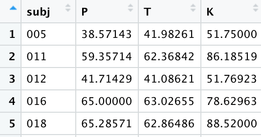
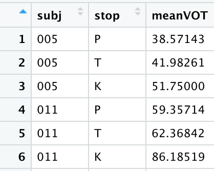

```{r setup, include=FALSE}
knitr::opts_chunk$set(echo = TRUE)
```

### Wide format data and long format data, and tidy data

Wide format data refers to a spreadsheet where a single row contains multiple columns for related attributes of a single data point or subject. For example, each column could be the response value for a trial in an experiment. As the name suggests, it is wide in appearance.

<br>

{width=25%}

<br>

Long format data refers to a spreadsheet where one column specifies an attribute of a data point and another column specifies the value of that attribute. That is, trial number/type would be listed in one column and the response value for that particular trial would be listed in another column. Subject information is frequently repeated across many rows. As the name suggests, it is long in appearance.

<br>

{width=20%}

<br>

Datasets are frequently a mix of the two types, such as the Jury dataset we’ve been using. It’s long format in the sense that we have multiple rows for each participant, but it’s wide in that several attributes of each pairwise comparison (like the 0-100 responses for typicality, similarity, and sameness) are spread across several columns. Though it’s a mix, this is considered to be a **tidy dataset**. Tidy datasets have one observation per row, one column per variable, and each intersection of a row/column contains a single value.

Tidy datasets are easiest to work with in R, but it’s not always the case that you will start with a tidy dataset. Sometimes you’ll have to spend some time to get it in the proper format. For instance, if you run a study on the popular experiment/survey site Qualtrics, the output will be *very* wide, with just one row per participant and every observation distributed across a large number of columns per variable.

Certain analyses and plots also frequently require the dataset to either be in wide or long format. For example, analyses or plots that require within-subject comparisons such as correlations or paired t-tests on subject means require wide format data: one column for each condition that will then be compared. Long format data is sometimes required for certain ggplots when you want to map an attribute of the data point to some aesthetic.

You don’t want to overthink this too much, but if you find yourself stuck in getting an analysis to work, you might have to pivot (some part of) the dataset to either long or wide format. To do this, we’ll use the pivot_longer() and pivot_wider() functions in the tidyr package of the tidyverse. 

### Wide to long format using tidyr

In addition to running the Jury study using the gamified experiment that you're familiar with, we also ran a boring version of the study on Qualtrics. The difference was that there were no flying cars or robot judge story, no expert witnesses or evidence... each level just had the same boring white background. The first level was a series of eight pairwise voice comparisons to which they supplied their typicality, similarity, and sameness ratings, then a short break, then another series of eight comparisons, then a short break, then the final series of eight comparisons.

On eClass you'll find a (considerably simplified) version of what you might encounter from Qualtrics. Download it and load it into R. Don't forget to load the tidyverse too, since most of the functions in this tutorial are from that set of packages!

```{r eval = T}
library(tidyverse)

jury_qualtrics <- read.csv("/Users/Thomas/Library/CloudStorage/OneDrive-YorkUniversity/LING 3300/Datasets/Jury/jury_qualtrics_wide.csv", header = TRUE)
```

Take a look at the dataset. Since this portion of the study was run in Qualtrics, the resulting data is in a very wide format, with just a single row per participant and a ton of columns. Each person rated their familiarity with SSBE, Middlebrough, and Newcastle accents just once, so the "Familiarity" columns aren't problematic. The potential problem here is the rest of the columns: A1_typ contains each participant's typicality rating when they encountered the a pair of sound files called A1, A1_sim contains each participant's similarity rating for that pair, and A1_same contains each participant's sameness rating for that pair. (We also have a separate dataset with more information on the exact detail each level and pair -- things like what the files were, what the accents were, whether the correct answer was that they're the same or different speakers, etc. In reality, each participant heard the pairs in a carefully randomized order, too -- but we won't worry about these details at the moment.) So you can see that we have A1 through A8, B1 through B8, and C1 through C8 -- the 24 pairs of sound files that each participant encountered over the course of the experiment, times the three ratings they provided for each pair, for a total of 72 columns that in reality should probably be simplified down to fewer columns in order to be of much use for calculating statistics or making plots.

So: let's transform this dataframe such that all the pairwise ratings are in a single, new "rating" column; we'll therefore also need to have a new column specifying the attributes of each rating in the column after it -- that is, to which pair and to what response scale was the participant responding when they supplied that particular rating? To do this, we use the function pivot_longer(). 

```{r eval = T}
jury_qualtrics_long <- jury_qualtrics %>% 
  pivot_longer(cols = A1_typ:C8_same, 
               names_to = "question", 
               values_to = "rating")
```

This function takes three arguments: 

* "cols", where we give it the **range of columns we want to transform**: here, we specify all the columns between A1_typ and C8_same
* "names_to", where we tell it the name of the new column to which we want to transfer the **names of the old columns**
* "values_to", where we tell it the name of the new column to which we want to transfer the **values in the cells**.

Note that for "cols" here, we could have specified these columns in various ways, but using the colon to get all columns between A1_typ and C8_same is probably the best. One (very tedious) alternative could have been: c(A1_typ,A1_sim,A1_same,A2_typ,A2_sim,A2_same...) until we'd typed out all 72 of the old columns. Or we could have done one of the following, which are two different ways to ask R to select all columns whose names contain the character strings "typ" or "sim" or "same".

```{r eval = T}
jury_qualtrics_long <- jury_qualtrics %>% 
   pivot_longer(cols = contains("typ") | contains("sim") | contains("same"), 
                names_to = "question", 
                values_to = "rating")

jury_qualtrics_long <- jury_qualtrics %>% 
   pivot_longer(cols = contains(c("typ","sim","same")),
                names_to = "question", 
                values_to = "rating")
```

If you look at our resulting dataframe, you'll see that whereas before we had one row containing each participant code and their associated gender, age, and accent familiarity, we now have *72* of those rows all repeating the identical data for each participant. We now also have a single "question" column with the name of the pair number.

> __Hot tip: Let's split a column!__
This dataframe could be even more informative if we split up the "question" column into two parts: the pair name and the question type. Since there's an underscore delimiting these two elements in each cell, it's actually quite easy to split these using the tidyverse separate_wider_delim() function. Let's do this in preparation for the next step.

```{r eval = T}
jury_qualtrics_long <- jury_qualtrics_long %>% 
  separate_wider_delim(question, delim = "_", names = c("pair", "question_type"))
```

Below is an example of some plots that are particularly easy to make with the data in this long format. They shows the overall density plots for the ratings obtained for the three question types. If we didn't have a single column for question type, we wouldn't be able to make 

```{r eval = T}
ggplot(jury_qualtrics_long) + 
  geom_density(aes(x = rating, colour = question_type))

ggplot(jury_qualtrics_long) + 
  geom_density(aes(x = rating)) +
  facet_wrap(~question_type)
```

### Long to wide format using tidyr

The long format of this data is great for some uses. But there might also be situations where we want to get the data just a bit wider: We might want, for instance, to have a single column with all the typicality ratings, one with all the similarity ratings, and one with all the sameness ratings. This is very easy to do with -- you guessed it! -- pivot_wider():

```{r eval = T}
jury_qualtrics_wider <- jury_qualtrics_long %>% 
  pivot_wider(names_from = question_type,
              values_from = rating)
```

In the function, we use the names_from argument to refer to which column in the jury_qualtrics_long dataset contains the names that should become the new column names. The values_from argument refers to which column in the jury_qualtrics_long dataset contains the values that should fill the cells of those new columns.

Note also the difference in the use of quotations between pivot_longer() above and pivot_wider() here. In the tidyverse style of code, when we are creating a *new* column, we use quotes; when we are referring to an existing column, we leave it unquoted.

### Calculating margin of error + confidence interval

I recommend having your slides from Unit 4 open while you read the following.

Let's first read in our L2 lexical decision data and run the code that got us our nice reaction time means-of-means + sd + count + se dataframe.

```{r eval = T}
# Loading in the dataset
lex <- read.csv("/Users/Thomas/Library/CloudStorage/OneDrive-YorkUniversity/LING 3300/Datasets/L2_English_Lexical_Decision_Data.csv")

# Making a character-based column "gender" out of the previous numerical "sex" column
lex$gender <- ifelse(lex$sex == 1, "m", "f")

# Making a column for a (fairly arbitrary) subset of Germanic vs. other dominant languages
lex$Germanic <- ifelse(lex$domLang == "English" |
                         lex$domLang == "German" |
                         lex$domLang == "Norwegian" |
                         lex$domLang == "Danish" |
                         lex$domLang == "Afrikaans",
                       "Germanic", "Other")

# Making a dataframe called RTmeans that has some descriptive stats
RTmeans <- lex %>%  # We start with the overall data
  group_by(Germanic, gender, workerID) %>%  # We group by participant and keep in Germanic and gender
  summarize(meanRT = mean(RT), # We summarize the mean of the reaction times in a new meanRT column
            medianRT = median(RT),  # Plus a column for the median RT
            sdRT = sd(RT),  # And a column for the standard deviation of the RTs
            count = length(RT))  # And a count of how many observations there were

# Now, from that by-speaker list of descriptive stats, we make a dataframe called RTgrandmeans
RTgrandmeans <- RTmeans %>% 
  group_by(Germanic, gender) %>% # We group by Germanic and gender...
  summarize(meanofmeansRT = mean(meanRT), # ...and get a mean of the by-participant means...
            sdofmeansRT = sd(meanRT), # ...and the standard deviation of those by-participant means...
            count = length(meanRT)) # ...and the number of participants in each category

# And also then calculate the standard error of the mean by dividing the std of means by the square root of the counts
RTgrandmeans$se <- RTgrandmeans$sdofmeansRT / sqrt(RTgrandmeans$count)
```
Now that we have the standard error of the means, we can calculate the confidence interval around each of the Germanic/non-Germanic and M/F combinations of reaction time means-of-means. Recall that the confidence interval is the mean ± the margin of error. The formula for margin of error is: standard error times the t-value or z-value for a particular confidence level. Using the t-value rather than the z-value is recommended when there's a relatively low number of samples (under 30 or so), or where we don't know the population standard deviation. Here we have plenty of samples, but as with most measurements in linguistics, we can't really claim to know what the population-wide standard deviation is, so let's stick with t-values.

How do we get a t-value? Well, the R function qt() will give that to us! qt() requires two arguments (see slide 21 from Unit 4 lecture): the point in the t-distribution you want to find the value for and the degrees of freedom in your sample.

Let's say that we want to report a 95% confidence interval, as is most typical in linguistics. Recall that since the difference between 95% and 100% is 5%, that means our alpha is 0.05. Remember how we talked about that 0.05 being split between the upper and lower tails of the normal distribution? That means that some important numbers to keep in mind as we calculate our t-values will be 0.025 and 0.975.

In addition to those numbers, we also need to know our degrees of freedom. To get degrees of freedom, we just take our sample size minus one. So first, let's make a new column that takes our sample size counts and subtracts one, to give us degrees of freedom. You can probably already see that this makes a relatively small difference for our data, where we have hundreds of samples; this subtraction of one would make a bigger impact if we had smaller sample sizes

```{r eval = T}
RTgrandmeans$df <- RTgrandmeans$count - 1
```

Now that we have a *df* column for each of the conditions, we can make another column calculating the lower t-values and the upper t-values.

```{r eval = T}
RTgrandmeans$tval_lower <- qt(0.025, RTgrandmeans$df)
RTgrandmeans$tval_upper <- qt(0.975, RTgrandmeans$df)
```

Now that we have our degrees of freedom and our t-values in columns, we can calculate the margin of error for each of the rows by multiplying the standard error by the t-values.

```{r eval = T}
RTgrandmeans$margin_of_error_lower <- RTgrandmeans$se * RTgrandmeans$tval_lower
RTgrandmeans$margin_of_error_upper <- RTgrandmeans$se * RTgrandmeans$tval_upper
```

Look in the dataframe and see that now you've got the margin of error around the mean that will comprise your confidence interval: plus or minus that particular number. So our last step will be to add or subtract that value from the mean to find the lower and upper bounds of the CI. Since the lower margin of error is already negative, we can *add* that to our mean and it will count as subtraction.

```{r eval = T}
RTgrandmeans$lower95CI <- RTgrandmeans$meanofmeansRT + RTgrandmeans$margin_of_error_lower
RTgrandmeans$upper95CI <- RTgrandmeans$meanofmeansRT + RTgrandmeans$margin_of_error_upper
```

### Visualizing confidence intervals

We have everything we need here to make plots of these confidence intervals. Let's make a plot with the means plotted as points, which we can do with geom_point(). We can add bars for the confidence intervals with geom_errorbar(). We can split the data by Germanic vs. non-Germanic on the x-axis, have the y-axis be reaction time, and separate the genders by colour. For the error bar, we can set ymin (the bar's lowest point) to be the lower 95% CI and the ymax (the bar's highest point) to be the upper 95% CI.

```{r eval = T}
ggplot(RTgrandmeans) +
  geom_point(aes(x = Germanic, y = meanofmeansRT, color = gender)) +
  geom_errorbar(aes(x = Germanic, y = meanofmeansRT, color = gender, ymin = lower95CI, ymax = upper95CI))
```

So far we've been making ggplots by putting the dataframe name inside ggplot() and all the aesthetics inside the individual plotting functions. But do you see how we have the identical aesthetics aes(x = Germanic, y = meanofmeansRT, color = gender) in both of the plotting functions here? When multiple plotting functions take the same dataframe and aesthetics, we can (sometimes) save some space by sticking the parts of aes() that should be applied to all of the functions into the ggplot() function. The following code therefore accomplishes the same thing as above. Like I've been saying, there are usually many different ways to accomplish the same thing in R!
 
```{r eval = T}
ggplot(RTgrandmeans, aes(x = Germanic, y = meanofmeansRT, color = gender)) +
  geom_point() +
  geom_errorbar(aes(ymin = lower95CI, ymax = upper95CI))
```

Anyway -- this plot isn't that great yet, for one thing because our mean points and error bars are overlapping. We use the command *position = position_dodge(width = 0.5)* in both the geom_point() and geom_errorbar() functions in order to spread them apart a bit horizontally. (Unfortunately, it doesn't seem like you can easily stick this command inside the overall ggplot() function even though it's identical for both plotting functions. Sometimes R is just odd that way.)

```{r eval = T}
ggplot(RTgrandmeans, aes(x = Germanic, y = meanofmeansRT, color = gender)) +
  geom_point(position = position_dodge(width = 0.5)) +
  geom_errorbar(aes(ymin = lower95CI, ymax = upper95CI), position = position_dodge(width = 0.5))
```

You can also play around with the size of the mean point, the widths of the error bars, and the width of the error bar lines.

```{r eval = T}
ggplot(RTgrandmeans, aes(x = Germanic, y = meanofmeansRT, color = gender)) +
  geom_point(position = position_dodge(width = 0.4), size = 3) +
  geom_errorbar(aes(ymin = lower95CI, ymax = upper95CI), width = 0.15, position = position_dodge(width = 0.4), linewidth = 0.6)
```

Alright. Now our lines of code are getting awfully long! Luckily, we can add some line returns in such a way that the whole thing will run the same way as before! If you have begun a function with an open parenthesis and haven't closed it yet, you can you add as many line breaks as you'd like and R will ignore them and keep reading to figure out what comes next until it gets to the final closing parenthesis. Here's the same code, but spaced out a bit more to make things more legible:

```{r eval = T}
ggplot(RTgrandmeans, 
       aes(x = Germanic,
           y = meanofmeansRT, 
           color = gender)) +
  geom_point(position = position_dodge(width = 0.4), 
             size = 3) +
  geom_errorbar(aes(ymin = lower95CI, ymax = upper95CI),
                width = 0.15,
                position = position_dodge(width = 0.4),
                linewidth = 0.6)
```

It's also rather common to see line returns after some opening parentheses and before some ending parentheses. Here's another way to write the code which might help you keep track of all the parentheses going on, since as soon as you start having lots of line breaks and embedded functions things can get messy.

```{r eval = T}
ggplot(
  RTgrandmeans, 
  aes(
    x = Germanic, 
    y = meanofmeansRT, 
    color = gender
    )
  ) +
  geom_point(
    position = position_dodge(width = 0.4), 
    size = 3
    ) +
  geom_errorbar(
    aes(ymin = lower95CI, ymax = upper95CI), 
    width = 0.15, 
    position = position_dodge(width = 0.4), 
    linewidth = 0.6
    )
```

The number and placement of your line breaks is really a matter of style and comfort -- as long as the code runs correctly without errors, it's up to you how to code, though I do encourage you to break up particularly long lines of code so that they are more readable.

We can also add nicer labels and a title, or beautify the plot with themes:

```{r eval = T}
ggplot(RTgrandmeans, aes(x = Germanic, y = meanofmeansRT, color = gender)) +
  geom_point(position = position_dodge(width = 0.4), size = 3) +
  geom_errorbar(
    aes(ymin = lower95CI, ymax = upper95CI),
    width = 0.15,
    position = position_dodge(width = 0.4),
    linewidth = 0.6
  ) +
  labs(
    x = "Language family",
    y = "Mean RT",
    color = "Gender",
    title = "Mean of means of RT with 95% CI whiskers"
  ) +
  theme_minimal()
```


#### Practice
1. We've seen above how to make a set of rating density plots facetted by question type. Now, see if you can wrangle this Qualtrics data into a format that allows you to create a similarly facetted set of rating density plots for the ratings of familiarity with SSBE, Middlesbrough, and Newcastle accents. After transforming the data, create the set of facetted plots.
2. In this Qualtrics jury dataset, each participant only gave us one estimate for how familiar they'd rate themselves with regard to each accent (Middlesbrough, Newcastle, or SSBE). Even though we've mostly been discussing the standard error when talking about calculating the mean of means, we don't actually need to find multiple means (such as lots of participant-internal means) to calculate standard error and therefore confidence intervals. So let's try it on this Qualtrics dataset: Calculate the mean familiarity rating for each accent, along with the 95% confidence interval around each accent mean. Then make a plot that visualizes these means and CIs. Note that here you won't have to worry about defining colours or dodging the positions -- since we just care about one independent variable here (Accent), this will be a simpler ggplot to make than the above ones where we wanted to show the interaction of two independent variables (Germanic and gender).


<font size="1.5"> Disclaimer: Some of these original materials were put together by Eleanor Chodroff and Elisa Passoni for the University of York. Thomas Kettig then inherited it and modified as needed, particularly based on notes by Nathan Sanders from the University of Toronto. The R software and the packages are distributed under the terms of the GNU General Public License, either Version 2, June 1991 or Version 3, June 2007 (run the command licence () for more information)</font>
